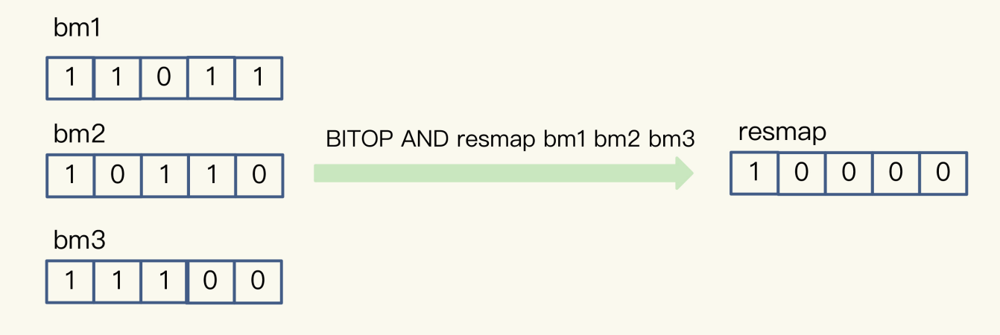

# 统计签到打卡

# 二值状态统计

二值状态就是指集合元素的取值就只有 0 和 1 两种。在签到打卡的场景中，我们只用记录签到（1）或未签到（0），所以它就是非常典型的二值状态，

在签到统计时，每个用户一天的签到用 1 个 bit 位就能表示，一个月（假设是 31 天）的签到情况用 31 个 bit 位就可以，而一年的签到也只需要用 365 个 bit 位，根本不用太复杂的集合类型。这个时候，我们就可以选择 Bitmap。这是 Redis 提供的扩展数据类型。

Bitmap 提供了 GETBIT/SETBIT 操作，使用一个偏移值 offset 对 bit 数组的某一个 bit 位进行读和写。不过，需要注意的是，Bitmap 的偏移量是从 0 开始算的，也就是说 offset 的最小值是 0。当使用 SETBIT 对一个 bit 位进行写操作时，这个 bit 位会被设置为 1。Bitmap 还提供了 BITCOUNT 操作，用来统计这个 bit 数组中所有“1”的个数。

假设我们要统计 ID 3000 的用户在 2020 年 8 月份的签到情况:

第一步，执行下面的命令，记录该用户 8 月 3 号已签到:

```sh
SETBIT uid:sign:3000:202008 2 1
```

第二步，检查该用户 8 月 3 日是否签到:

```sh
GETBIT uid:sign:3000:202008 2
```

第三步，统计该用户在 8 月份的签到次数:

```sh
BITCOUNT uid:sign:3000:202008
```
<br></br>
**如果记录了 1 亿个用户 10 天的签到情况，你有办法统计出这 10 天连续签到的用户总数吗？**

在介绍具体的方法之前，我们要先知道，Bitmap 支持用 BITOP 命令对多个 Bitmap 按位做“与”“或”“异或”的操作，操作的结果会保存到一个新的 Bitmap 中。

我以按位“与”操作为例来具体解释一下。从下图中，可以看到，三个 Bitmap bm1、bm2 和 bm3，对应 bit 位做“与”操作，结果保存到了一个新的 Bitmap 中



在统计 1 亿个用户连续 10 天的签到情况时，你可以把每天的日期作为 key，每个 key 对应一个 1 亿位的 Bitmap，每一个 bit 对应一个用户当天的签到情况。

接下来，我们对 10 个 Bitmap 做“与”操作，得到的结果也是一个 Bitmap。在这个 Bitmap 中，只有 10 天都签到的用户对应的 bit 位上的值才会是 1。最后，我们可以用 BITCOUNT 统计下 Bitmap 中的 1 的个数，这就是连续签到 10 天的用户总数了。

现在，我们可以计算一下记录了 10 天签到情况后的内存开销。每天使用 1 个 1 亿位的 Bitmap，大约占 12MB 的内存（10^8/8/1024/1024），10 天的 Bitmap 的内存开销约为 120MB，内存压力不算太大。不过，在实际应用时，最好对 Bitmap 设置过期时间，让 Redis 自动删除不再需要的签到记录，以节省内存开销。

所以，如果只需要统计数据的二值状态，例如商品有没有、用户在不在等，就可以使用 Bitmap，因为它只用一个 bit 位就能表示 0 或 1。在记录海量数据时，Bitmap 能够有效地节省内存空间。

