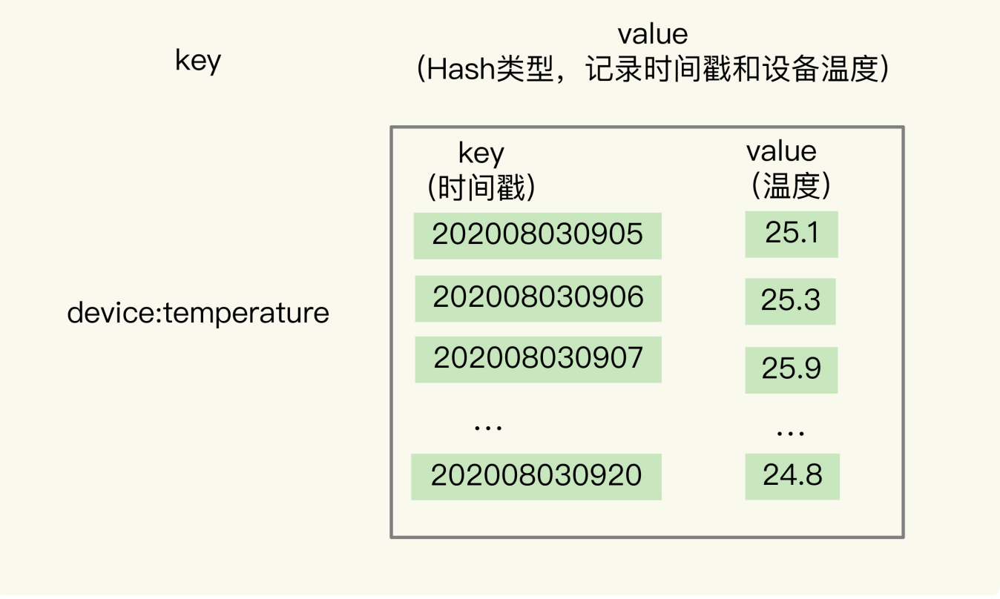
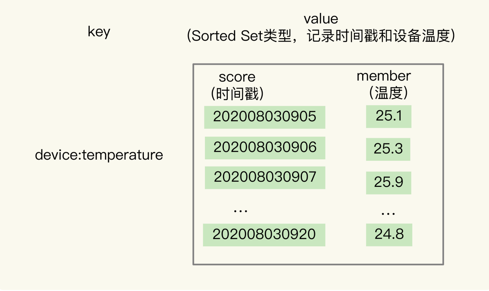

# 保存时间序列数据

# 什么是时间序列数据

我们现在做互联网产品的时候，都有这么一个需求：记录用户在网站或者 App 上的点击行为数据，来分析用户行为。这里的数据一般包括用户 ID、行为类型（例如浏览、登录、下单等）、行为发生的时间戳：

```
UserID, Type, TimeStamp
```

或者一个物联网项目的数据存取需求，我们需要周期性地统计近万台设备的实时状态，包括设备 ID、压力、温度、湿度，以及对应的时间戳：

```
DeviceID, Pressure, Temperature, Humidity, TimeStamp
```

这些与发生时间相关的一组数据，就是时间序列数据。这些数据的特点是没有严格的关系模型，记录的信息可以表示成键和值的关系（例如，一个设备 ID 对应一条记录），所以，并不需要专门用关系型数据库（例如 MySQL）来保存。而 Redis 的键值数据模型，正好可以满足这里的数据存取需求。

# 时间序列数据的读写特点

在实际应用中，时间序列数据通常是持续高并发写入的，例如，需要连续记录数万个设备的实时状态值。同时，时间序列数据的写入主要就是插入新数据，而不是更新一个已存在的数据，也就是说，一个时间序列数据被记录后通常就不会变了，因为它就代表了一个设备在某个时刻的状态值（例如，一个设备在某个时刻的温度测量值，一旦记录下来，这个值本身就不会再变了）。

所以，这种数据的写入特点很简单，就是插入数据快，这就要求我们选择的数据类型，在进行数据插入时，复杂度要低，尽量不要阻塞。看到这儿，你可能第一时间会想到用 Redis 的 String、Hash 类型来保存，因为它们的插入复杂度都是 O(1)，是个不错的选择。但是，String 类型在记录小数据时（例如刚才例子中的设备温度值），元数据的内存开销比较大，不太适合保存大量数据。

时间序列数据的“读”操作有什么特点呢？

我们在查询时间序列数据时，既有对单条记录的查询（例如查询某个设备在某一个时刻的运行状态信息，对应的就是这个设备的一条记录），也有对某个时间范围内的数据的查询（例如每天早上 8 点到 10 点的所有设备的状态信息）。

除此之外，还有一些更复杂的查询，比如对某个时间范围内的数据做聚合计算。这里的聚合计算，就是对符合查询条件的所有数据做计算，包括计算均值、最大 / 最小值、求和等。例如，我们要计算某个时间段内的设备压力的最大值，来判断是否有故障发生。

所以读的特点就是查询模式多。

# 基于 Hash 和 Sorted Set 保存时间序列数据

关于 Hash 类型，我们都知道，它有一个特点是，可以实现对单键的快速查询。这就满足了时间序列数据的单键查询需求。我们可以把时间戳作为 Hash 集合的 key，把记录的设备状态值作为 Hash 集合的 value。

可以看下用 Hash 集合记录设备的温度值的示意图：



当我们想要查询某个时间点或者是多个时间点上的温度数据时，直接使用 HGET 命令或者 HMGET 命令：

```sh
HGET device:temperature 202008030905
"25.1"
HMGET device:temperature 202008030905 202008030907 202008030908
1) "25.1"
2) "25.9"
3) "24.9"
```

但是，Hash 类型有个短板：它并不支持对数据进行范围查询。

为了能同时支持按时间戳范围的查询，可以用 Sorted Set 来保存时间序列数据，因为它能够根据元素的权重分数来排序。我们可以把时间戳作为 Sorted Set 集合的元素分数，把时间点上记录的数据作为元素本身。



比如我们来查询一下在 2020 年 8 月 3 日 9 点 7 分到 9 点 10 分间的所有温度值：

```sh
ZRANGEBYSCORE device:temperature 202008030907 202008030910
1) "25.9"
2) "24.9"
3) "25.3"
4) "25.2"
```

这样，我们同时使用 Hash 和 Sorted Set，可以满足单个时间点和一个时间范围内的数据查询需求，但是我们又会面临一个新的问题：如何保证写入 Hash 和 Sorted Set 是一个原子性的操作呢？

这里就涉及到了 Redis 用来实现简单的事务的 MULTI 和 EXEC 命令。当多个命令及其参数本身无误时，MULTI 和 EXEC 命令可以保证执行这些命令时的原子性。

::: tip Redis事务：
MULTI 命令：表示一系列原子性操作的开始。收到这个命令后，Redis 就知道，接下来再收到的命令需要放到一个内部队列中，后续一起执行，保证原子性。

EXEC 命令：表示一系列原子性操作的结束。一旦 Redis 收到了这个命令，就表示所有要保证原子性的命令操作都已经发送完成了。此时，Redis 开始执行刚才放到内部队列中的所有命令操作。
:::

我们把设备在 2020 年 8 月 3 日 9 时 5 分的温度，分别用 HSET 命令和 ZADD 命令写入 Hash 集合和 Sorted Set 集合:

```sh
127.0.0.1:6379> MULTI
OK
127.0.0.1:6379> HSET device:temperature 202008030911 26.8
QUEUED
127.0.0.1:6379> ZADD device:temperature 202008030911 26.8
QUEUED
127.0.0.1:6379> EXEC
1) (integer) 1
2) (integer) 1
```

可以看到，首先，Redis 收到了客户端执行的 MULTI 命令。然后，客户端再执行 HSET 和 ZADD 命令后，Redis 返回的结果为“QUEUED”，表示这两个命令暂时入队，先不执行；执行了 EXEC 命令后，HSET 命令和 ZADD 命令才真正执行，并返回成功结果（结果值为 1）。

接下来，我们还有一个问题：如何对时间序列数据进行聚合计算？

如果我们先把时间范围内的数据取回到客户端，然后在客户端自行完成聚合计算。这个方法虽然能完成聚合计算，但是会带来一定的潜在风险，也就是大量数据在 Redis 实例和客户端间频繁传输，这会和其他操作命令竞争网络资源，导致其他操作变慢。为了避免客户端和 Redis 实例间频繁的大量数据传输，我们可以使用 RedisTimeSeries 来保存时间序列数据。

总结：

这种方案也有两个不足：一个是，在执行聚合计算时，我们需要把数据读取到客户端再进行聚合，当有大量数据要聚合时，数据传输开销大；另一个是，所有的数据会在两个数据类型中各保存一份，内存开销不小。不过，我们可以通过设置适当的数据过期时间，释放内存，减小内存压力。


# 基于 RedisTimeSeries 模块保存时间序列数据

RedisTimeSeries 是 Redis 的一个扩展模块。它专门面向时间序列数据提供了数据类型和访问接口，并且支持在 Redis 实例上直接对数据进行按时间范围的聚合计算。

当用于时间序列数据存取时，RedisTimeSeries 的操作主要有 5 个：
- 用 TS.CREATE 命令创建时间序列数据集合；
- 用 TS.ADD 命令插入数据；
- 用 TS.GET 命令读取最新数据；
- 用 TS.MGET 命令按标签过滤查询数据集合；
- 用 TS.RANGE 支持聚合计算的范围查询。


**1.用 TS.CREATE 命令创建一个时间序列数据集合**

在 TS.CREATE 命令中，我们需要设置时间序列数据集合的 key 和数据的过期时间（以毫秒为单位）。此外，我们还可以为数据集合设置标签，来表示数据集合的属性。例如，我们执行下面的命令，创建一个 key 为 device:temperature、数据有效期为 600s 的时间序列数据集合。也就是说，这个集合中的数据创建了 600s 后，就会被自动删除。最后，我们给这个集合设置了一个标签属性{device_id:1}，表明这个数据集合中记录的是属于设备 ID 号为 1 的数据。

```sh
TS.CREATE device:temperature RETENTION 600000 LABELS device_id 1
OK
```

**2.用 TS.ADD 命令插入数据，用 TS.GET 命令读取最新数据**

我们可以用 TS.ADD 命令往时间序列集合中插入数据，包括时间戳和具体的数值，并使用 TS.GET 命令读取数据集合中的最新一条数据。

例如，我们执行下列 TS.ADD 命令时，就往 device:temperature 集合中插入了一条数据，记录的是设备在 2020 年 8 月 3 日 9 时 5 分的设备温度；再执行 TS.GET 命令时，就会把刚刚插入的最新数据读取出来。

```sh
TS.ADD device:temperature 1596416700 25.1
1596416700
TS.GET device:temperature
25.1
```

**3.用 TS.MGET 命令按标签过滤查询数据集合**

在保存多个设备的时间序列数据时，我们通常会把不同设备的数据保存到不同集合中。此时，我们就可以使用 TS.MGET 命令，按照标签查询部分集合中的最新数据。在使用TS.CREATE 创建数据集合时，我们可以给集合设置标签属性。

举个例子。假设我们一共用 4 个集合为 4 个设备保存时间序列数据，设备的 ID 号是 1、2、3、4，我们在创建数据集合时，把 device_id 设置为每个集合的标签。此时，我们就可以使用下列 TS.MGET 命令，以及 FILTER 设置（这个配置项用来设置集合标签的过滤条件），查询 device_id 不等于 2 的所有其他设备的数据集合，并返回各自集合中的最新的一条数据。

```sh
TS.MGET FILTER device_id!=2
1) 1) "device:temperature:1"
2) (empty list or set)
3) 1) (integer) 1596417000
2) "25.3"
2) 1) "device:temperature:3"
2) (empty list or set)
3) 1) (integer) 1596417000
2) "29.5"
3) 1) "device:temperature:4"
2) (empty list or set)
3) 1) (integer) 1596417000
2) "30.1"
```

**4.用 TS.RANGE 支持需要聚合计算的范围查询**

最后，在对时间序列数据进行聚合计算时，我们可以使用 TS.RANGE 命令指定要查询的数据的时间范围，同时用 AGGREGATION 参数指定要执行的聚合计算类型。RedisTimeSeries 支持的聚合计算类型很丰富，包括求均值（avg）、求最大 / 最小值（max/min），求和（sum）等。

例如，在执行下列命令时，我们就可以按照每 180s 的时间窗口，对 2020 年 8 月 3 日 9 时 5 分和 2020 年 8 月 3 日 9 时 12 分这段时间内的数据进行均值计算了。

```sh
TS.RANGE device:temperature 1596416700 1596417120 AGGREGATION avg 180000
1) 1) (integer) 1596416700
2) "25.6"
2) 1) (integer) 1596416880
2) "25.8"
3) 1) (integer) 1596417060
2) "26.1"
```

与使用 Hash 和 Sorted Set 来保存时间序列数据相比，RedisTimeSeries 是专门为时间序列数据访问设计的扩展模块，能支持在 Redis 实例上直接进行聚合计算，以及按标签属性过滤查询数据集合，当我们需要频繁进行聚合计算，以及从大量集合中筛选出特定设备或用户的数据集合时，RedisTimeSeries 就可以发挥优势了。

<br></br>
**总结：**

和第一种方案相比，RedisTimeSeries 能支持直接在 Redis 实例上进行多种数据聚合计算，避免了大量数据在实例和客户端间传输。不过，RedisTimeSeries 的底层数据结构使用了链表，它的范围查询的复杂度是 O(N) 级别的，同时，它的 TS.GET 查询只能返回最新的数据，没有办法像第一种方案的 Hash 类型一样，可以返回任一时间点的数据。

如果你的部署环境中网络带宽高、Redis 实例内存大，可以优先考虑第一种方案。如果你的部署环境中网络、内存资源有限，而且数据量大，聚合计算频繁，需要按数据集合属性查询，可以优先考虑第二种方案。