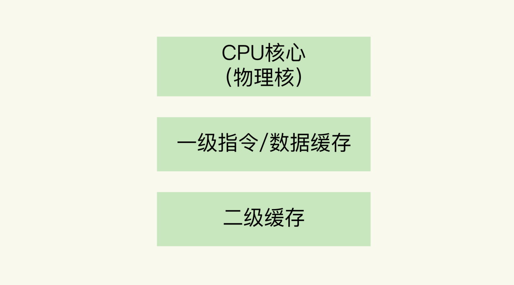
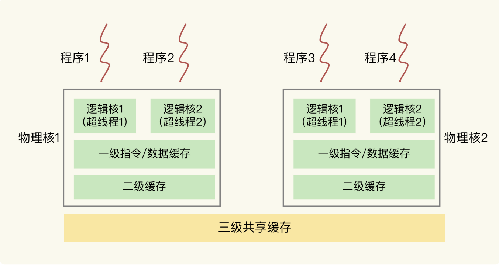
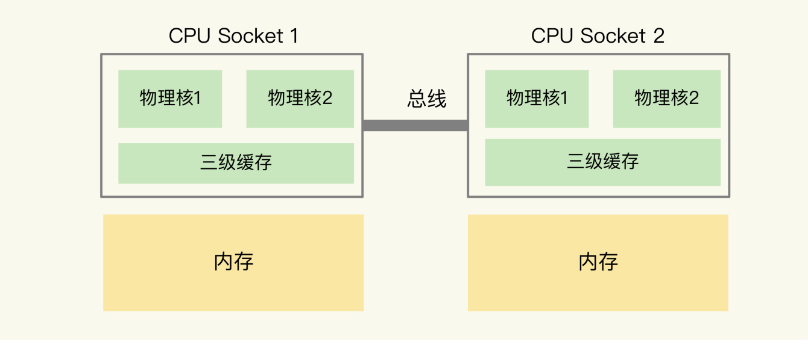
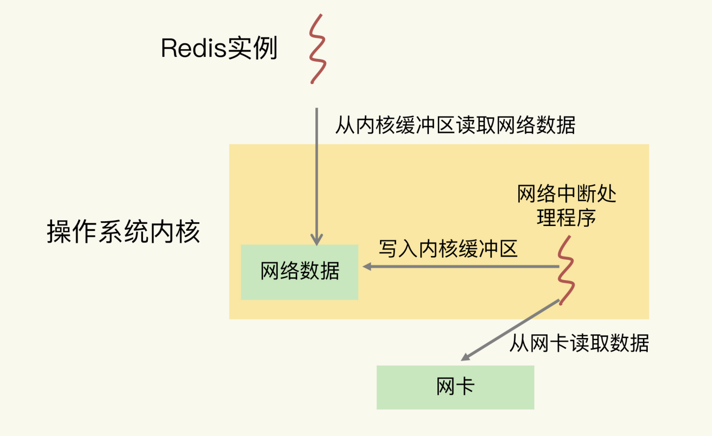
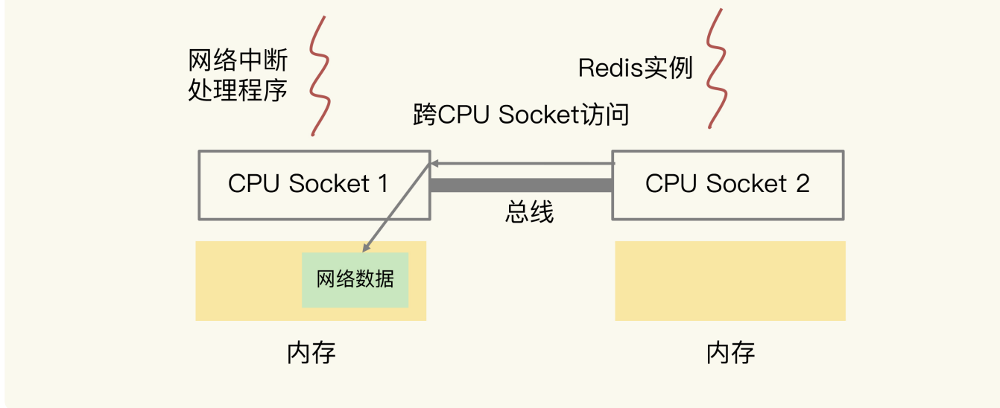
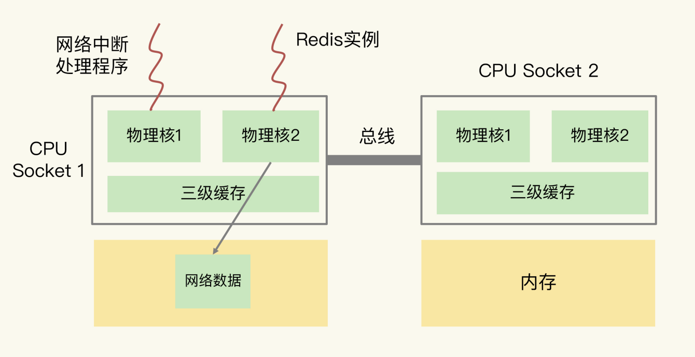

#  为什么CPU结构也会影响Redis的性能？

# 主流的 CPU 架构

一个 CPU 处理器中一般有多个运行核心，我们把一个运行核心称为一个物理核，每个物理核都可以运行应用程序。每个物理核都拥有私有的一级缓存（Level 1 cache，简称 L1 cache），包括一级指令缓存和一级数据缓存，以及私有的二级缓存（Level 2 cache，简称 L2 cache）。

这里提到了一个概念，就是物理核的私有缓存。它其实是指缓存空间只能被当前的这个物理核使用，其他的物理核无法对这个核的缓存空间进行数据存取。我们来看一下 CPU 物理核的架构。



因为 L1 和 L2 缓存是每个物理核私有的，所以，当数据或指令保存在 L1、L2 缓存时，物理核访问它们的延迟不超过 10 纳秒，速度非常快。

但是，这些 L1 和 L2 缓存的大小受限于处理器的制造技术，一般只有 KB 级别，存不下太多的数据。如果 L1、L2 缓存中没有所需的数据，应用程序就需要访问内存来获取数据。而应用程序的访存延迟一般在百纳秒级别，是访问 L1、L2 缓存的延迟的近 10 倍。

所以，不同的物理核还会共享一个共同的三级缓存（Level 3 cache，简称为 L3 cache）。L3 缓存能够使用的存储资源比较多，所以一般比较大，能达到几 MB 到几十 MB，这就能让应用程序缓存更多的数据。当 L1、L2 缓存中没有数据缓存时，可以访问 L3，尽可能避免访问内存。

另外，现在主流的 CPU 处理器中，每个物理核通常都会运行两个超线程，也叫作逻辑核。同一个物理核的逻辑核会共享使用 L1、L2 缓存。



在主流的服务器上，一个 CPU 处理器会有 10 到 20 多个物理核。同时，为了提升服务器的处理能力，服务器上通常还会有多个 CPU 处理器（也称为多 CPU Socket），每个处理器有自己的物理核（包括 L1、L2 缓存），L3 缓存，以及连接的内存，同时，不同处理器间通过总线连接。

下图显示的就是多 CPU Socket 的架构，图中有两个 Socket，每个 Socket 有两个物理核。



在多 CPU 架构上，应用程序可以在不同的处理器上运行。在刚才的图中，Redis 可以先在 Socket 1 上运行一段时间，然后再被调度到 Socket 2 上运行。

但是，有个地方需要你注意一下：如果应用程序先在一个 Socket 上运行，并且把数据保存到了内存，然后被调度到另一个 Socket 上运行，此时，应用程序再进行内存访问时，就需要访问之前 Socket 上连接的内存，这种访问属于远端内存访问。和访问 Socket 直接连接的内存相比，远端内存访问会增加应用程序的延迟。

在多 CPU 架构下，一个应用程序访问所在 Socket 的本地内存和访问远端内存的延迟并不一致，所以，我们也把这个架构称为非统一内存访问架构（Non-Uniform Memory Access，NUMA 架构）。

# CPU 多核对 Redis 性能的影响

在一个 CPU 核上运行时，应用程序需要记录自身使用的软硬件资源信息（例如栈指针、CPU 核的寄存器值等），我们把这些信息称为运行时信息。同时，应用程序访问最频繁的指令和数据还会被缓存到 L1、L2 缓存上，以便提升执行速度。

但是，在多核 CPU 的场景下，一旦应用程序需要在一个新的 CPU 核上运行，那么，运行时信息就需要重新加载到新的 CPU 核上。而且，新的 CPU 核的 L1、L2 缓存也需要重新加载数据和指令，这会导致程序的运行时间增加。


说到这儿，我想跟你分享一个我曾经在多核 CPU 环境下对 Redis 性能进行调优的案例。

当时，我们的项目需求是要对 Redis 的 99% 尾延迟进行优化，要求 GET 尾延迟小于 300 微秒，PUT 尾延迟小于 500 微秒。

刚开始的时候，我们使用 GET/PUT 复杂度为 O(1) 的 String 类型进行数据存取，同时关闭了 RDB 和 AOF，而且，Redis 实例中没有保存集合类型的其他数据，也就没有 bigkey 操作，避免了可能导致延迟增加的许多情况。

但是，即使这样，我们在一台有 24 个 CPU 核的服务器上运行 Redis 实例，GET 和 PUT 的 99% 尾延迟分别是 504 微秒和 1175 微秒，明显大于我们设定的目标。后来，我们仔细检测了 Redis 实例运行时的服务器 CPU 的状态指标值，这才发现，CPU 的 context switch 次数比较多。

context switch 是指线程的上下文切换，这里的上下文就是线程的运行时信息。在 CPU 多核的环境中，一个线程先在一个 CPU 核上运行，之后又切换到另一个 CPU 核上运行，这时就会发生 context switch。

当 context switch 发生后，Redis 主线程的运行时信息需要被重新加载到另一个 CPU 核上，而且，此时，另一个 CPU 核上的 L1、L2 缓存中，并没有 Redis 实例之前运行时频繁访问的指令和数据，所以，这些指令和数据都需要重新从 L3 缓存，甚至是内存中加载。这个重新加载的过程是需要花费一定时间的。而且，Redis 实例需要等待这个重新加载的过程完成后，才能开始处理请求，所以，这也会导致一些请求的处理时间增加。

如果在 CPU 多核场景下，Redis 实例被频繁调度到不同 CPU 核上运行的话，那么，对Redis 实例的请求处理时间影响就更大了。每调度一次，一些请求就会受到运行时信息、指令和数据重新加载过程的影响，这就会导致某些请求的延迟明显高于其他请求。分析到这里，我们就知道了刚刚的例子中 99% 尾延迟的值始终降不下来的原因。

所以，我们要避免 Redis 总是在不同 CPU 核上来回调度执行。于是，我们尝试着把 Redis 实例和 CPU 核绑定了，让一个 Redis 实例固定运行在一个 CPU 核上。我们可以使用 taskset 命令把一个程序绑定在一个核上运行。

::: tip taskset 命令：
比如说，我们执行下面的命令，就把 Redis 实例绑在了 0 号核上，其中，“-c”选项用于设置要绑定的核编号。
```sh
taskset -c 0 ./redis-server
```
:::


结果问题解决了！，在 CPU 多核的环境下，通过绑定 Redis 实例和 CPU 核，可以有效降低 Redis 的尾延迟。当然，绑核不仅对降低尾延迟有好处，同样也能降低平均延迟、提升吞吐率，进而提升 Redis 性能。

# CPU 的 NUMA 架构对 Redis 性能的影响

在实际应用 Redis 时，我经常看到一种做法，为了提升 Redis 的网络性能，把操作系统的网络中断处理程序和 CPU 核绑定。这个做法可以避免网络中断处理程序在不同核上来回调度执行，的确能有效提升 Redis 的网络处理性能。

但是，网络中断程序是要和 Redis 实例进行网络数据交互的，一旦把网络中断程序绑核后，我们就需要注意 Redis 实例是绑在哪个核上了，这会关系到 Redis 访问网络数据的效率高低。

我们先来看下 Redis 实例和网络中断程序的数据交互：网络中断处理程序从网卡硬件中读取数据，并把数据写入到操作系统内核维护的一块内存缓冲区。内核会通过 epoll 机制触发事件，通知 Redis 实例，Redis 实例再把数据从内核的内存缓冲区拷贝到自己的内存空间，如下图所示：



那么，在 CPU 的 NUMA 架构下，当网络中断处理程序、Redis 实例分别和 CPU 核绑定后，就会有一个潜在的风险：如果网络中断处理程序和 Redis 实例各自所绑的 CPU 核不在同一个 CPU Socket 上，那么，Redis 实例读取网络数据时，就需要跨 CPU Socket 访问内存，这个过程会花费较多时间。



图中的网络中断处理程序被绑在了 CPU Socket 1 的某个核上，而 Redis 实例则被绑在了 CPU Socket 2 上。此时，网络中断处理程序读取到的网络数据，被保存在 CPU Socket 1 的本地内存中，当 Redis 实例要访问网络数据时，就需要 Socket 2 通过总线把内存访问命令发送到 Socket 1 上，进行远程访问，时间开销比较大。

我们曾经做过测试，和访问 CPU Socket 本地内存相比，跨 CPU Socket 的内存访问延迟增加了 18%，这自然会导致 Redis 处理请求的延迟增加。

所以，为了避免 Redis 跨 CPU Socket 访问网络数据，我们最好把网络中断程序和 Redis 实例绑在同一个 CPU Socket 上，这样一来，Redis 实例就可以直接从本地内存读取网络数据了，如下图所示：



不过，需要注意的是，在 CPU 的 NUMA 架构下，对 CPU 核的编号规则，并不是先把一个 CPU Socket 中的所有逻辑核编完，再对下一个 CPU Socket 中的逻辑核编码，而是先给每个 CPU Socket 中每个物理核的第一个逻辑核依次编号，再给每个 CPU Socket 中的物理核的第二个逻辑核依次编号。


# 绑核的风险和解决方案

当我们把 Redis 实例绑到一个 CPU 逻辑核上时，就会导致子进程、后台线程和 Redis 主线程竞争 CPU 资源，一旦子进程或后台线程占用 CPU 时，主线程就会被阻塞，导致 Redis 请求延迟增加。

针对这种情况，有两种解决方案，分别是一个 Redis 实例对应绑一个物理核和优化 Redis 源码。

**方案一：一个 Redis 实例对应绑一个物理核：**

在给 Redis 实例绑核时，我们不要把一个实例和一个逻辑核绑定，而要和一个物理核绑定，也就是说，把一个物理核的 2 个逻辑核都用上。

和只绑一个逻辑核相比，把 Redis 实例和物理核绑定，可以让主线程、子进程、后台线程共享使用 2 个逻辑核，可以在一定程度上缓解 CPU 资源竞争。但是，因为只用了 2 个逻辑核，它们相互之间的 CPU 竞争仍然还会存在。如果你还想进一步减少 CPU 竞争，只能优化 Redis 源码

# 总结

在多核 CPU 架构下，Redis 如果在不同的核上运行，就需要频繁地进行上下文切换，这个过程会增加 Redis 的执行时间，客户端也会观察到较高的尾延迟了。所以，建议你在Redis 运行时，把实例和某个核绑定，这样，就能重复利用核上的 L1、L2 缓存，可以降低响应延迟。

为了提升 Redis 的网络性能，我们有时还会把网络中断处理程序和 CPU 核绑定。在这种情况下，如果服务器使用的是 NUMA 架构，Redis 实例一旦被调度到和中断处理程序不在同一个 CPU Socket，就要跨 CPU Socket 访问网络数据，这就会降低 Redis 的性能。建议你把 Redis 实例和网络中断处理程序绑在同一个 CPU Socket 下的不同核上， 这样可以提升 Redis 的运行性能。

虽然绑核可以帮助 Redis 降低请求执行时间，但是，除了主线程，Redis 还有用于 RDB 和 AOF 重写的子进程，以及 4.0 版本之后提供的用于惰性删除的后台线程。当 Redis 实例和一个逻辑核绑定后，这些子进程和后台线程会和主线程竞争 CPU 资源，也会对 Redis 性能造成影响。如果不想修改 Redis 代码，可以把按一个 Redis 实例一个物理核方式进行绑定，这样，Redis 的主线程、子进程和后台线程可以共享使用一个物理核上的两个逻辑核。