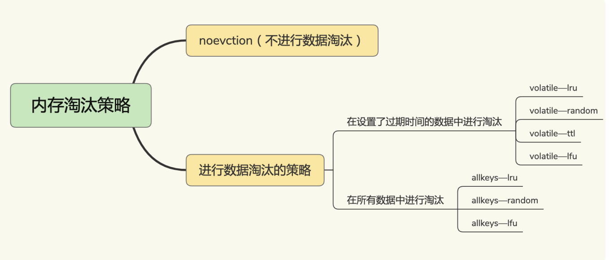

# 缓存淘汰策略

默认情况下，Redis 在使用的内存空间超过 maxmemory 值时，并不会淘汰数据，也就是设定的 noeviction 策略。一旦缓存被写满了，再有写请求来时，Redis 不再提供服务，而是直接返回错误。

我们再分析下 volatile-random、volatile-ttl、volatile-lru 和 volatile-lfu 这四种淘汰策略。它们筛选的候选数据范围，被限制在已经设置了过期时间的键值对上。

- volatile-ttl 在筛选时，会针对设置了过期时间的键值对，根据过期时间的先后进行删除，越早过期的越先被删除。
- volatile-random 就像它的名称一样，在设置了过期时间的键值对中，进行随机删除。
- volatile-lru 会使用 LRU 算法筛选设置了过期时间的键值对。
- volatile-lfu 会使用 LFU 算法选择设置了过期时间的键值对。

allkeys-lru、allkeys-random、allkeys-lfu 这三种淘汰策略的备选淘汰数据范围，就扩大到了所有键值对，无论这些键值对是否设置了过期时间。它们筛选数据进行淘汰的规则是：

- allkeys-random 策略，从所有键值对中随机选择并删除数据；
- allkeys-lru 策略，使用 LRU 算法在所有数据中进行筛选。
- allkeys-lfu 策略，使用 LFU 算法在所有数据中进行筛选。

# 对 LRU 算法优化

LRU 算法在实际实现时，需要用链表管理所有的缓存数据，这会带来额外的空间开销。而且，当有数据被访问时，需要在链表上把该数据移动到 MRU 端，如果有大量数据被访问，就会带来很多链表移动操作，会很耗时，进而会降低 Redis 缓存性能。

所以，在 Redis 中，LRU 算法被做了简化，以减轻数据淘汰对缓存性能的影响。具体来说，Redis 默认会记录每个数据的最近一次访问的时间戳（由键值对数据结构 RedisObject 中的 lru 字段记录）。然后，Redis 在决定淘汰的数据时，第一次会随机选出 N 个数据，把它们作为一个候选集合。接下来，Redis 会比较这 N 个数据的 lru 字段，把 lru 字段值最小的数据从缓存中淘汰出去。

当需要再次淘汰数据时，Redis 需要挑选数据进入第一次淘汰时创建的候选集合。这儿的挑选标准是：能进入候选集合的数据的 lru 字段值必须小于候选集合中最小的 lru 值。当有新数据进入候选数据集后，如果候选数据集中的数据个数达到了 maxmemorysamples，Redis 就把候选数据集中 lru 字段值最小的数据淘汰出去。

这样一来，Redis 缓存不用为所有的数据维护一个大链表，也不用在每次数据访问时都移动链表项，提升了缓存的性能。

# 缓存策略选择

优先使用 allkeys-lru 策略。这样，可以充分利用 LRU 这一经典缓存算法的优势，把最近最常访问的数据留在缓存中，提升应用的访问性能。如果你的业务数据中有明显的冷热数据区分，我建议你使用 allkeys-lru 策略。如果业务应用中的数据访问频率相差不大，没有明显的冷热数据区分，建议使用 allkeys-random 策略，随机选择淘汰的数据就行。

如果你的业务中有置顶的需求，比如置顶新闻、置顶视频，那么，可以使用 volatile-lru 策略，同时不给这些置顶数据设置过期时间。这样一来，这些需要置顶的数据一直不会被删除，而其他数据会在过期时根据 LRU 规则进行筛选

