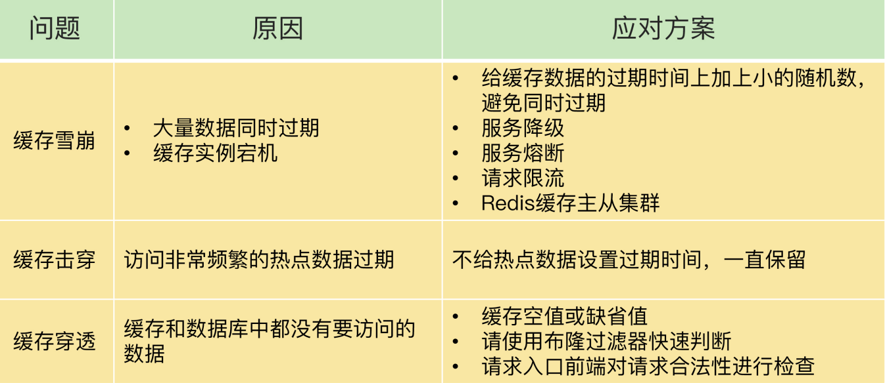

# 缓存穿透

缓存穿透是指要访问的数据既不在 Redis 缓存中，也不在数据库中，导致请求在访问缓存时，发生缓存缺失，再去访问数据库时，发现数据库中也没有要访问的数据，如果应用持续有大量请求访问数据，就会同时给缓存和数据库带来巨大压力。

# 解决方案一：缓存空值或缺省值

一旦发生缓存穿透，我们就可以针对查询的数据，在 Redis 中缓存一个空值或是和业务层协商确定的缺省值（例如，库存的缺省值可以设为 0）。紧接着，应用发送的后续请求再进行查询时，就可以直接从 Redis 中读取空值或缺省值，返回给业务应用了，避免了把大量请求发送给数据库处理，保持了数据库的正常运行。

但是这种方案无法针对随机请求不同key的恶意攻击。

# 解决方案二：布隆过滤器

布隆过滤器由一个初值都为 0 的 bit 数组和 N 个哈希函数组成，可以用来快速判断某个数据是否存在。当我们想标记某个数据存在时（例如，数据已被写入数据库），布隆过滤器会通过三个操作完成标记：

- 首先，使用 N 个哈希函数，分别计算这个数据的哈希值，得到 N 个哈希值。
- 然后，我们把这 N 个哈希值对 bit 数组的长度取模，得到每个哈希值在数组中的对应位置。
- 最后，我们把对应位置的 bit 位设置为 1，这就完成了在布隆过滤器中标记数据的操作。

当需要查询某个数据时，我们就执行刚刚说的计算过程，先得到这个数据在 bit 数组中对应的 N 个位置。紧接着，我们查看 bit 数组中这 N 个位置上的 bit 值。只要这 N 个 bit 值有一个不为 1，这就表明查询的数据一定没有在数据库中保存。

# 解决方案三：前端进行请求检测

缓存穿透的一个原因是有大量的恶意请求访问不存在的数据，所以，一个有效的应对方案是在请求入口前端，对业务系统接收到的请求进行合法性检测，把恶意的请求（例如请求参数不合理、请求参数是非法值、请求字段不存在）直接过滤掉，不让它们访问后端缓存和数据库。这样一来，也就不会出现缓存穿透问题了。

# 总结

