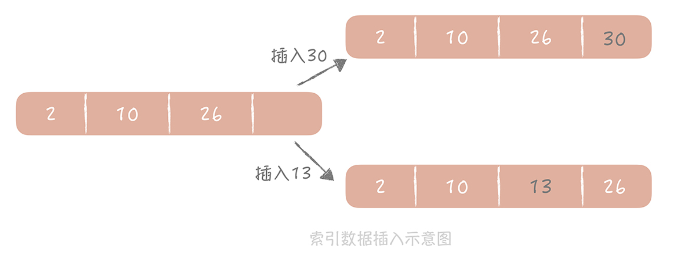

# 主键设计

分库分表后，数据库自增id就不能使用了，一般使用的是 **变种的 Snowflake 算法来生成业务需要的 ID **

## 为什么不能用UUID？

为什么不使用UUID呢？

UUID（Universally Unique Identifier，通用唯一标识码）不依赖于任何第三方系统，所以在性能和可用性上都比较好，**我一般会使用它生成 Request ID 来标记单次请求**， 但是如果用它来作为数据库主键，它会存在以下几点问题。

首先，生成的 ID 最好具有单调递增性，也就是有序的，而 UUID 不具备这个特点。为什么 ID 要是有序的呢？ **因为在系统设计时，ID 有可能成为排序的字段。**我给你举个例子。

比如，你要实现一套评论的系统时，你一般会设计两个表，一张评论表，存储评论的详细信息，其中有 ID 字段，有评论的内容，还有评论人 ID，被评论内容的 ID 等等，以 ID 字段作为分区键；另一个是评论列表，存储着内容 ID 和评论 ID 的对应关系，以内容 ID 为分区键。

我们在获取内容的评论列表时，需要按照时间序倒序排列，因为 ID 是时间上有序的，所以我们就可以按照评论 ID 的倒序排列。而如果评论 ID 不是在时间上有序的话，我们就需要在评论列表中再存储一个多余的创建时间的列用作排序，造成了存储空间上的浪费

**另一个原因在于 ID 有序也会提升数据的写入性能。**

我们知道 MySQL InnoDB 存储引擎使用 `B+ 树` 存储索引数据，而主键也是一种索引。索引数据在 `B+ 树` 中是有序排列的，就像下面这张图一样，图中 2，10，26 都是记录的 ID，也是索引数据。

这时，当插入的下一条记录的 ID 是递增的时候，比如插入 30 时，数据库只需要把它追加到后面就好了。但是如果插入的数据是无序的，比如 ID 是 13，那么数据库就要查找 13 应该插入的位置，再挪动 13 后面的数据，这就造成了多余的数据移动的开销。

我们知道机械磁盘在完成随机的写时，需要先做 「寻道」找到要写入的位置，也就是让磁头找到对应的磁道，这个过程是非常耗时的。**而顺序写就不需要寻道，会大大提升索引的写入性能** 。

**UUID 不能作为 ID 的另一个原因是它不具备业务含义，** 其实现实世界中使用的 ID 中都包含有一些有意义的数据，这些数据会出现在 ID 的固定的位置上。比如说我们使用的身份证的前六位是地区编号；7～14 位是身份证持有人的生日；不同城市电话号码的区号是不同的；你从手机号码的的前三位就可以看出这个手机号隶属于哪一个运营商。而如果生成的 ID 可以被反解，那么从反解出来的信息中我们可以对 ID 来做验证，我们可以从中知道这个 ID 的生成时间，从哪个机房的发号器中生成的，为哪个业务服务的，对于问题的排查有一定的帮助。

最后，UUID 是由 32 个 16 进制数字组成的字符串，如果作为数据库主键使用比较耗费空间。

## 雪花算法

twitter 提出的 Snowflake 算法完全可以弥补 UUID 存在的不足，因为它不仅算法简单易实现，也满足 ID 所需要的全局唯一性，单调递增性，还包含一定的业务上的意义。

Snowflake 的核心思想是将 64bit 的二进制数字分成若干部分，每一部分都存储有特定含义的数据，比如说时间戳、机器 ID、序列号等等，最终生成全局唯一的有序 ID。它的标准算法是这样的：

那么了解了 Snowflake 算法的原理之后，我们如何把它工程化，来为业务生成全局唯一的 ID 呢？ **一般来说我们会有两种算法的实现方式：**

**一种是嵌入到业务代码里，也就是分布在业务服务器中。** 这种方案的好处是业务代码在使用的时候不需要跨网络调用，性能上会好一些，但是就需要更多的机器 ID 位数来支持更多的业务服务器。另外，由于业务服务器的数量很多，我们很难保证机器 ID 的唯一性，所以就需要引入 ZooKeeper 等分布式一致性组件来保证每次机器重启时都能获得唯一的机器 ID。

**另外一个部署方式是作为独立的服务部署，这也就是我们常说的发号器服务。** 业务在使用发号器的时候就需要多一次的网络调用，但是内网的调用对于性能的损耗有限，却可以减少机器 ID 的位数，如果发号器以主备方式部署，同时运行的只有一个发号器，那么机器 ID 可以省略，这样可以留更多的位数给最后的自增信息位。即使需要机器 ID，因为发号器部署实例数有限，那么就可以把机器 ID 写在发号器的配置文件里，这样即可以保证机器 ID 唯一性，也无需引入第三方组件了。 **微博和美图都是使用独立服务的方式来部署发号器的，性能上单实例单 CPU 可以达到两万每秒。**

Snowflake 算法设计的非常简单且巧妙，性能上也足够高效，同时也能够生成 **具有全局唯一性、单调递增性和有业务含义的 ID** ，但是它也有一些缺点，**其中最大的缺点就是它依赖于系统的时间戳**，一旦系统时间不准，就有可能生成重复的 ID。所以如果我们发现系统时钟不准，就可以让发号器暂时拒绝发号，直到时钟准确为止。

另外，如果请求发号器的 QPS 不高，比如说发号器每毫秒只发一个 ID，就会造成生成 ID 的末位永远是 1，那么在分库分表时如果使用 ID 作为分区键就会造成库表分配的不均匀。 **这一点，也是我在实际项目中踩过的坑，而解决办法主要有两个：**

1.时间戳不记录毫秒而是记录秒，这样在一个时间区间里可以多发出几个号，避免出现分库分表时数据分配不均。
2.生成的序列号的起始号可以做一下随机，这一秒是 21，下一秒是 30，这样就会尽量的均衡了。

