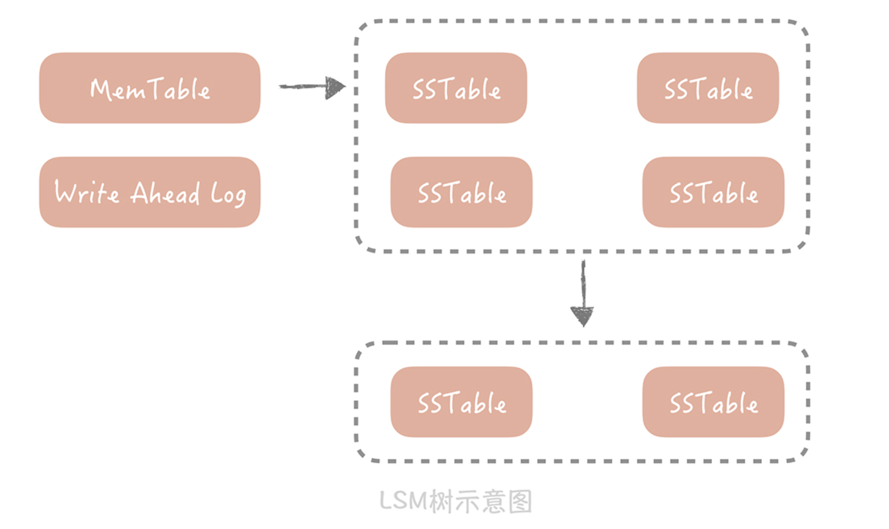
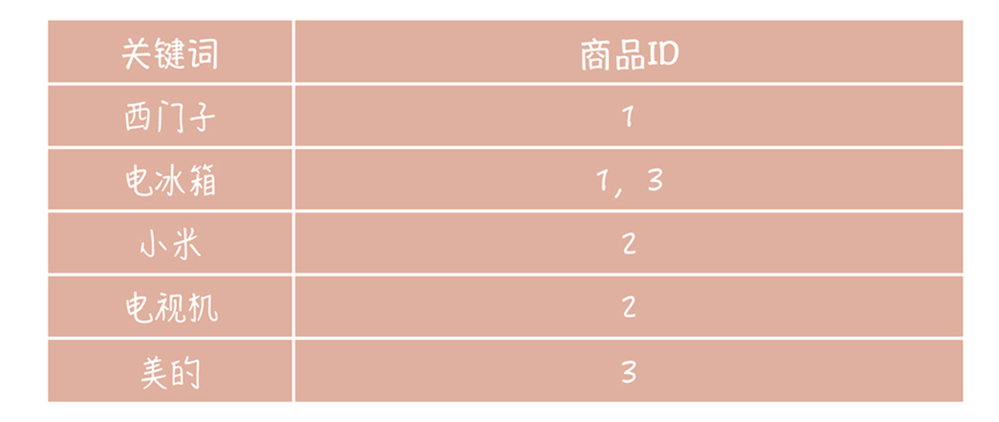
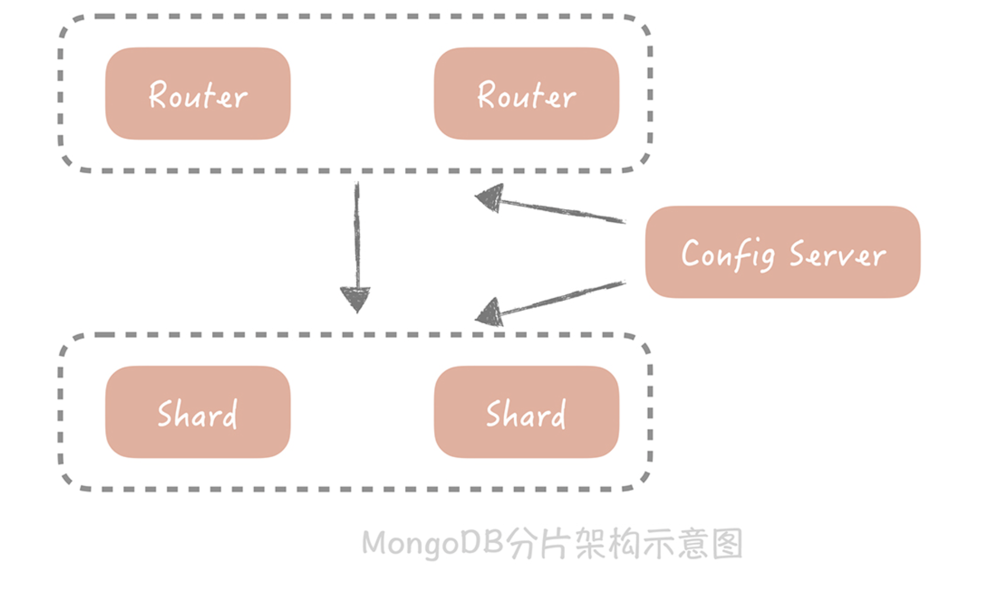

# NoSQL数据库互补

## NoSQL分类

在微博项目中关系的数据量达到了千亿，那么即使分隔成 1024 个库表，每张表的数据量也达到了亿级别，并且关系的数据量还在以极快的速度增加，即使你分隔成再多的库表，数据量也会很快增加到瓶颈。这个问题用传统数据库很难根本解决，因为它在扩展性方面是很弱的，这时，就可以利用 NoSQL，因为它有着天生分布式的能力，能够提供优秀的读写性能，可以很好地补充传统关系型数据库的短板。

NoSQL 想必你很熟悉，它指的是不同于传统的关系型数据库的其他数据库系统的统称，它不使用 SQL 作为查询语言，提供优秀的横向扩展能力和读写性能，非常契合互联网项目高并发大数据的特点。所以一些大厂，比如小米、微博、陌陌都很倾向使用它来作为高并发大容量的数据存储服务。

NoSQL 数据库发展到现在，十几年间，出现了多种类型，我来给你举几个例子：

- Redis、LevelDB 这样的 **KV 存储**。这类存储相比于传统的数据库的优势是极高的读写性能，一般对性能有比较高的要求的场景会使用。
- Hbase、Cassandra 这样的 **列式存储数据库**。这种数据库的特点是数据不像传统数据库以行为单位来存储，而是以列来存储，适用于一些离线数据统计的场景。
- 像 MongoDB、CouchDB 这样的文档型数据库。这种数据库的特点是 Schema Free（模式自由），数据表中的字段可以任意扩展，比如说电商系统中的商品有非常多的字段，并且不同品类的商品的字段也都不尽相同，使用关系型数据库就需要不断增加字段支持，而用文档型数据库就简单很多了。

在 NoSQL 数据库刚刚被应用时，它被认为是可以替代关系型数据库的银弹，在我看来，也许因为以下几个方面的原因：

- 弥补了传统数据库在性能方面的不足；
- 数据库变更方便，不需要更改原先的数据结构；
- 适合互联网项目常见的大数据量的场景；

不过，这种看法是个误区，因为慢慢地我们发现在业务开发的场景下还是需要利用 SQL 语句的强大的查询功能以及传统数据库事务和灵活的索引等功能，NoSQL 只能作为一些场景的补充。

那么接下来，我就带你了解 **NoSQL 数据库是如何做到与关系数据库互补的。** 了解这部分内容，你可以在实际项目中更好地使用 NoSQL 数据库补充传统数据库的不足。

首先，我们来关注一下数据库的写入性能。

## 使用NoSQL提升写入性能

数据库系统大多使用的是传统的机械磁盘，对于机械磁盘的访问方式有两种：

- 一种是随机 IO

  随机 IO 就需要花费时间做昂贵的磁盘寻道，一般来说，它的读写效率要比顺序 IO 小两到三个数量级，所以我们想要提升写入的性能就要尽量减少随机 IO

- 另一种是顺序 IO

以 MySQL 的 InnoDB 存储引擎来说，更新 binlog、redolog、undolog **都是在做顺序 IO**，而更新 datafile 和索引文件则是在做随机 IO，而为了减少随机 IO 的发生，关系数据库已经做了很多的优化，比如说写入时先写入内存，然后批量刷新到磁盘上，但是随机 IO 还是会发生。

索引在 InnoDB 引擎中是以 B+ 树（上一节课提到了 B+ 树，你可以回顾一下）方式来组织的，而 MySQL 主键是聚簇索引（一种索引类型，数据与索引数据放在一起），既然数据和索引数据放在一起，那么在数据插入或者更新的时候，我们需要找到要插入的位置，再把数据写到特定的位置上，这就产生了随机的 IO。而且一旦发生了页分裂，就不可避免会做数据的移动，也会极大地损耗写入性能。

**NoSQL 数据库是怎么解决这个问题的呢？**

它们有多种的解决方式，这里我给你讲一种最常见的方案，就是很多 NoSQL 数据库都在使用的 **基于 LSM 树的存储引擎，** 这种算法使用最多，所以在这里着重剖析一下。

LSM 树（Log-Structured Merge Tree）牺牲了一定的读性能来换取写入数据的高性能，Hbase、Cassandra、LevelDB 都是用这种算法作为存储的引擎。

它的思想很简单，数据首先会写入到一个叫做 MemTable 的内存结构中，在 MemTable 中数据是按照写入的 Key 来排序的。为了防止 MemTable 里面的数据因为机器掉电或者重启而丢失，一般会通过写 Write Ahead Log 的方式将数据备份在磁盘上。

MemTable 在累积到一定规模时，它会被刷新生成一个新的文件，我们把这个文件叫做 SSTable（Sorted String Table）。当 SSTable 达到一定数量时，我们会将这些 SSTable 合并，减少文件的数量，因为 SSTable 都是有序的，所以合并的速度也很快。

当从 LSM 树里面读数据时，我们首先从 MemTable 中查找数据，如果数据没有找到，再从 SSTable 中查找数据。因为存储的数据都是有序的，所以查找的效率是很高的，只是因为数据被拆分成多个 SSTable，所以读取的效率会低于 B+ 树索引。

和 LSM 树类似的算法有很多，比如说 TokuDB 使用的名为 Fractal tree 的索引结构，它们的核心思想就是将随机 IO 变成顺序的 IO，从而提升写入的性能。

## 场景补充

除了可以提升性能之外，NoSQL 数据库还可以在某些场景下作为传统关系型数据库的补充，来看一个具体的例子。

假设某一天，CEO 找到你并且告诉你，他正在为你的垂直电商项目规划搜索的功能，需要支持按照商品的名称模糊搜索到对应的商品，希望你尽快调研出解决方案。

一开始，你认为这非常的简单，不就是在数据库里面执行一条类似：`select * from product where name like ‘%***%’` 的语句吗？可是在实际执行的过程中，却发现了问题。

你发现这类语句并不是都能使用到索引，只有后模糊匹配的语句才能使用索引。比如语句 `select * from product where name like ‘% 电冰箱’` 就没有使用到字段 `name` 上的索引，而 `select * from product where name like ‘索尼 %’` 就使用了 `name` 上的索引。而一旦没有使用索引就会扫描全表的数据，在性能上是无法接受的。

于是你在谷歌上搜索了一下解决方案，发现大家都在使用开源组件 Elasticsearch 来支持搜索的请求，它本身是基于“倒排索引”来实现的， **那么什么是倒排索引呢？**

倒排索引是指将记录中的某些列做分词，然后形成的分词与记录 ID 之间的映射关系。比如说，你的垂直电商项目里面有以下记录：

那么，我们将商品名称做简单的分词，然后建立起分词和商品 ID 的对应关系，就像下面展示的这样：

这样，如果用户搜索电冰箱，就可以给他展示商品 ID 为 1 和 3 的两件商品了。

而 Elasticsearch 作为一种常见的 NoSQL 数据库， **就以倒排索引作为核心技术原理，为你提供了分布式的全文搜索服务，这在传统的关系型数据库中使用 SQL 语句是很难实现的。** 所以你看，NoSQL 可以在某些业务场景下代替传统数据库提供数据存储服务。

## 提升扩展性

另外，在扩展性方面，很多 NoSQL 数据库也有着先天的优势。还是以你的垂直电商系统为例，你已经为你的电商系统增加了评论系统，开始你的评估比较乐观，觉得电商系统的评论量级不会增长很快，所以就为它分了 8 个库，每个库拆分成 16 张表。

但是评论系统上线之后，存储量级增长的异常迅猛，你不得不将数据库拆分成更多的库表，而数据也要重新迁移到新的库表中，过程非常痛苦，而且数据迁移的过程也非常容易出错。

这时，你考虑是否可以考虑使用 NoSQL 数据库来彻底解决扩展性的问题，经过调研你发现它们在设计之初就考虑到了分布式和大数据存储的场景， **比如像 MongoDB 就有三个扩展性方面的特性。**

- 其一是 Replica，也叫做副本集，你可以理解为主从分离，也就是通过将数据拷贝成多份来保证当主挂掉后数据不会丢失。同时呢，Replica 还可以分担读请求。Replica 中有主节点来承担写请求，并且把对数据变动记录到 oplog 里（类似于 binlog）；从节点接收到 oplog 后就会修改自身的数据以保持和主节点的一致。一旦主节点挂掉，MongoDB 会从从节点中选取一个节点成为主节点，可以继续提供写数据服务。
- 其二是 Shard，也叫做分片，你可以理解为分库分表，即将数据按照某种规则拆分成多份，存储在不同的机器上。MongoDB 的 Sharding 特性一般需要三个角色来支持，一个是 Shard Server，它是实际存储数据的节点，是一个独立的 Mongod 进程；二是 Config Server，也是一组 Mongod 进程，主要存储一些元信息，比如说哪些分片存储了哪些数据等；最后是 Route Server，它不实际存储数据，仅仅作为路由使用，它从 Config Server 中获取元信息后，将请求路由到正确的 Shard Server 中。

- 其三是负载均衡，就是当 MongoDB 发现 Shard 之间数据分布不均匀，会启动 Balancer 进程对数据做重新的分配，最终让不同 Shard Server 的数据可以尽量的均衡。当我们的 Shard Server 存储空间不足需要扩容时，数据会自动被移动到新的 Shard Server 上，减少了数据迁移和验证的成本。

你可以看到，NoSQL 数据库中内置的扩展性方面的特性可以让我们不再需要对数据库做分库分表和主从分离，也是对传统数据库一个良好的补充。

小结：

1. 在性能方面，NoSQL 数据库使用一些算法将对磁盘的随机写转换成顺序写，提升了写的性能；
2. 在某些场景下，比如全文搜索功能，关系型数据库并不能高效地支持，需要 NoSQL 数据库的支持；
3. 在扩展性方面，NoSQL 数据库天生支持分布式，支持数据冗余和数据分片的特性。