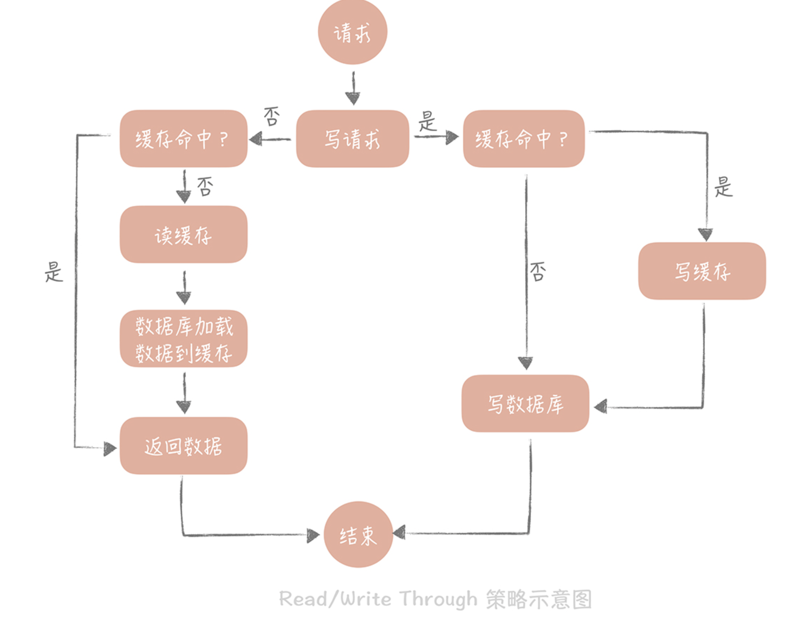

# Read/Write Through 策略

**这个策略的核心原则是用户只与缓存打交道，由缓存和数据库通信，写入或者读取数据** 。这就好比你在汇报工作的时候只对你的直接上级汇报，再由你的直接上级汇报给他的上级，你是不能越级汇报的。

Write Through 的策略是这样的：先查询要写入的数据在缓存中是否已经存在，如果已经存在，则更新缓存中的数据，并且由缓存组件同步更新到数据库中，如果缓存中数据不存在，我们把这种情况叫做 **Write Miss（写失效）**。

一般来说，我们可以选择两种 Write Miss 方式：

- Write Allocate（按写分配）

  做法是写入缓存相应位置，再由缓存组件同步更新到数据库中；

- No-write allocate（不按写分配）

  做法是不写入缓存中，而是直接更新到数据库中

在 Write Through 策略中，我们一般选择 `No-write allocate` 方式，原因是无论采用哪种 `Write Miss` 方式，我们都需要同步将数据更新到数据库中，而 `No-write allocate` 方式相比 `Write Allocate` 还减少了一次缓存的写入，能够提升写入的性能。

Read Through 策略就简单一些，它的步骤是这样的：先查询缓存中数据是否存在，如果存在则直接返回，如果不存在，则由缓存组件负责从数据库中同步加载数据。

下面是 Read Through/Write Through 策略的示意图：

Read Through/Write Through 策略的特点是 **由缓存节点而非用户来和数据库打交道 **，在我们开发过程中相比 Cache Aside 策略要少见一些，原因是我们经常使用的分布式缓存组件，无论是 Memcached 还是 Redis 都不提供写入数据库，或者自动加载数据库中的数据的功能。而我们在使用本地缓存的时候可以考虑使用这种策略，比如本地缓存 Guava Cache 中的 Loading Cache 就有 Read Through 策略的影子。

我们看到 **Write Through 策略中写数据库是同步的** ，这对于性能来说会有比较大的影响，因为相比于写缓存，同步写数据库的延迟就要高很多了。那么我们可否异步地更新数据库？这就是我们接下来要提到的 `Write Back` 策略。

