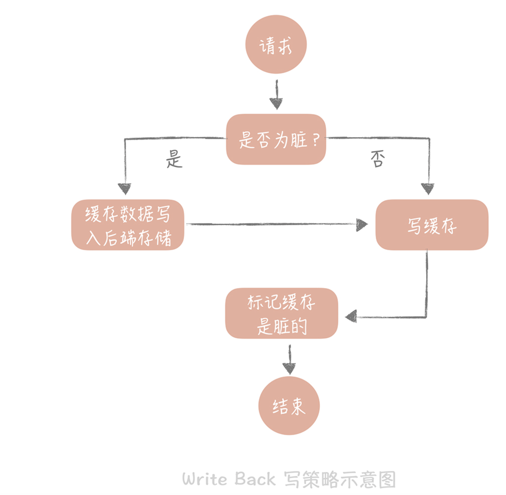
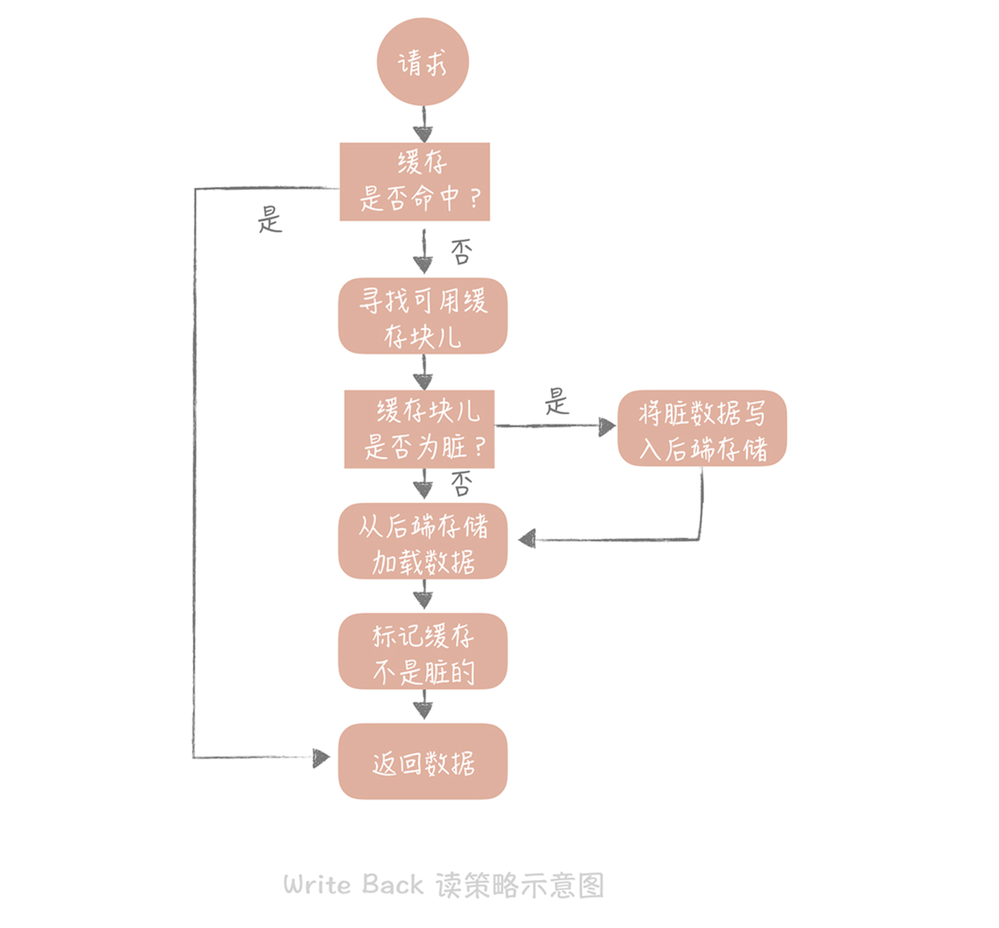

# Write Back 策略

这个策略的核心思想是 **在写入数据时只写入缓存，并且把缓存块儿标记为 「脏」 的**。而脏块儿只有被再次使用时才会将其中的数据写入到后端存储中。

**需要注意的是，** 在 `Write Miss` 的情况下，我们采用的是 `Write Allocate` 的方式，也就是在写入后端存储的同时要写入缓存，这样我们在之后的写请求中都只需要更新缓存即可，而无需更新后端存储了，我将 Write back 策略的示意图放在了下面：

**如果使用 Write Back 策略的话，读的策略也有一些变化了：**

1. 我们在读取缓存时如果发现 **缓存命中则直接返回缓存数据**。

2. 如果缓存不命中则寻找一个可用的缓存块儿

   如果这个缓存块儿是 「脏」的，就把缓存块儿中之前的数据写入到后端存储中，并且从后端存储加载数据到缓存块儿

   如果不是脏的，则由缓存组件将后端存储中的数据加载到缓存中，最后我们将缓存设置为不是脏的，返回数据就好了。

**发现了吗？** 其实这种策略不能被应用到我们常用的数据库和缓存的场景中，它是计算机体系结构中的设计，比如我们在向磁盘中写数据时采用的就是这种策略。无论是操作系统层面的 Page Cache，还是日志的异步刷盘，亦或是消息队列中消息的异步写入磁盘，大多采用了这种策略。因为这个策略在性能上的优势毋庸置疑，它避免了直接写磁盘造成的随机写问题，毕竟写内存和写磁盘的随机 I/O 的延迟相差了几个数量级呢。

但因为缓存一般使用内存，而内存是非持久化的，所以一旦缓存机器掉电，就会造成原本缓存中的脏块儿数据丢失。所以你会发现系统在掉电之后，之前写入的文件会有部分丢失，就是因为 Page Cache 还没有来得及刷盘造成的。

**当然，你依然可以在一些场景下使用这个策略，在使用时，我想给你的落地建议是：** 你在向低速设备写入数据的时候，可以在内存里先暂存一段时间的数据，甚至做一些统计汇总，然后定时地刷新到低速设备上。比如说，你在统计你的接口响应时间的时候，需要将每次请求的响应时间打印到日志中，然后监控系统收集日志后再做统计。但是如果每次请求都打印日志无疑会增加磁盘 I/O，那么不如把一段时间的响应时间暂存起来，经过简单的统计平均耗时，每个耗时区间的请求数量等等，然后定时地，批量地打印到日志中。