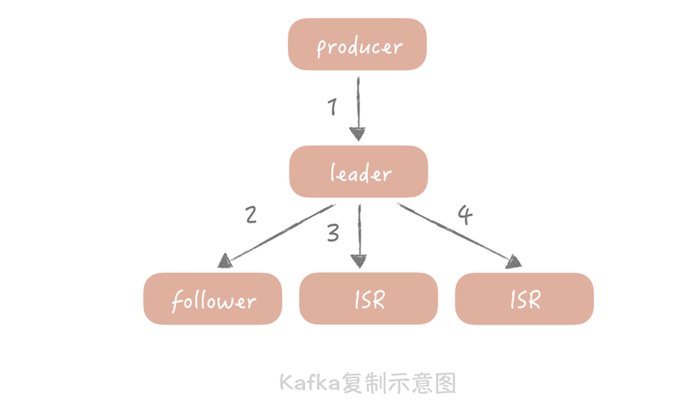

# 消息丢失

## 在消息生产的过程中丢失消息

首先，消息的生产者一般是我们的业务服务器，消息队列是独立部署在单独的服务器上的。两者之间的网络虽然是内网，但是也会存在抖动的可能，而一旦发生抖动，消息就有可能因为网络的错误而丢失。

**针对这种情况，我建议你采用的方案是消息重传：** 也就是当你发现发送超时后你就将消息重新发一次，但是你也不能无限制地重传消息。一般来说，如果不是消息队列发生故障，或者是到消息队列的网络断开了，重试 2～3 次就可以了。

不过，这种方案可能会造成消息的重复，从而导致在消费的时候会重复消费同样的消息。比方说，消息生产时由于消息队列处理慢或者网络的抖动，导致虽然最终写入消息队列成功，但在生产端却超时了，生产者重传这条消息就会形成重复的消息，那么针对上面的例子，直观显示在你面前的就会是你收到了两个现金红包。

## 在消息队列中丢失消息

拿 Kafka 举例，消息在 Kafka 中是存储在本地磁盘上的，而为了减少消息存储时对磁盘的随机 I/O，我们一般会将消息先写入到操作系统的 Page Cache 中，然后再找合适的时机刷新到磁盘上。

比如，Kafka 可以配置当达到某一时间间隔，或者累积一定的消息数量的时候再刷盘， **也就是所说的异步刷盘。**

来看一个形象的比喻：假如你经营一个图书馆，读者每还一本书你都要去把图书归位，不仅工作量大而且效率低下，但是如果你可以选择每隔 3 小时，或者图书达到一定数量的时候再把图书归位，这样可以把同一类型的书一起归位，节省了查找图书位置的时间，这样就可以提高效率了。

不过，如果发生机器掉电或者机器异常重启，那么 Page Cache 中还没有来得及刷盘的消息就会丢失了。 **那么怎么解决呢？**

你可能会把刷盘的间隔设置很短，或者设置累积一条消息就就刷盘，但这样频繁刷盘会对性能有比较大的影响，而且从经验来看，出现机器宕机或者掉电的几率也不高， **所以我不建议你这样做。**

如果你的电商系统对消息丢失的容忍度很低， **那么你可以考虑以集群方式部署 Kafka 服务，通过部署多个副本备份数据，保证消息尽量不丢失。**

那么它是怎么实现的呢？

Kafka 集群中有一个 Leader 负责消息的写入和消费，可以有多个 Follower 负责数据的备份。Follower 中有一个特殊的集合叫做 ISR（in-sync replicas），当 Leader 故障时，新选举出来的 Leader 会从 ISR 中选择，默认 Leader 的数据会异步地复制给 Follower，这样在 Leader 发生掉电或者宕机时，Kafka 会从 Follower 中消费消息，减少消息丢失的可能。

由于默认消息是异步地从 Leader 复制到 Follower 的，所以一旦 Leader 宕机，那些还没有来得及复制到 Follower 的消息还是会丢失。为了解决这个问题，Kafka 为生产者提供一个选项叫做 `acks`，当这个选项被设置为 `all` 时，生产者发送的每一条消息除了发给 Leader 外还会发给所有的 ISR，并且必须得到 Leader 和所有 ISR 的确认后才被认为发送成功。这样，只有 Leader 和所有的 ISR 都挂了，消息才会丢失。

从上面这张图来看，当设置 `acks=all` 时，需要同步执行 1，3，4 三个步骤，对于消息生产的性能来说也是有比较大的影响的，所以你在实际应用中需要仔细地权衡考量。 **我给你的建议是：**

1.如果你需要确保消息一条都不能丢失，那么建议不要开启消息队列的同步刷盘，而是需要使用集群的方式来解决，可以配置当所有 ISR Follower 都接收到消息才返回成功。
2.如果对消息的丢失有一定的容忍度，那么建议不部署集群，即使以集群方式部署，也建议配置只发送给一个 Follower 就可以返回成功了。
3.我们的业务系统一般对于消息的丢失有一定的容忍度，比如说以上面的红包系统为例，如果红包消息丢失了，我们只要后续给没有发送红包的用户补发红包就好了。

## 在消费的过程中存在消息丢失的可能

我还是以 Kafka 为例来说明。一个消费者消费消息的进度是记录在消息队列集群中的，而消费的过程分为三步：接收消息、处理消息、更新消费进度。

这里面接收消息和处理消息的过程都可能会发生异常或者失败，比如说，消息接收时网络发生抖动，导致消息并没有被正确的接收到；处理消息时可能发生一些业务的异常导致处理流程未执行完成，这时如果更新消费进度，那么这条失败的消息就永远不会被处理了，也可以认为是丢失了。

**所以，在这里你需要注意的是，** 一定要等到消息接收和处理完成后才能更新消费进度，但是这也会造成消息重复的问题，比方说某一条消息在处理之后，消费者恰好宕机了，那么因为没有更新消费进度，所以当这个消费者重启之后，还会重复地消费这条消息。

