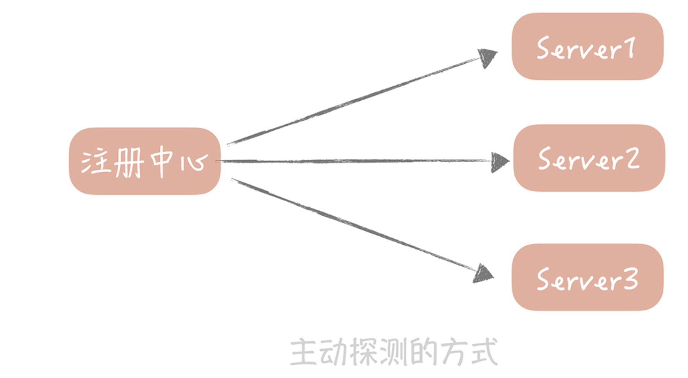
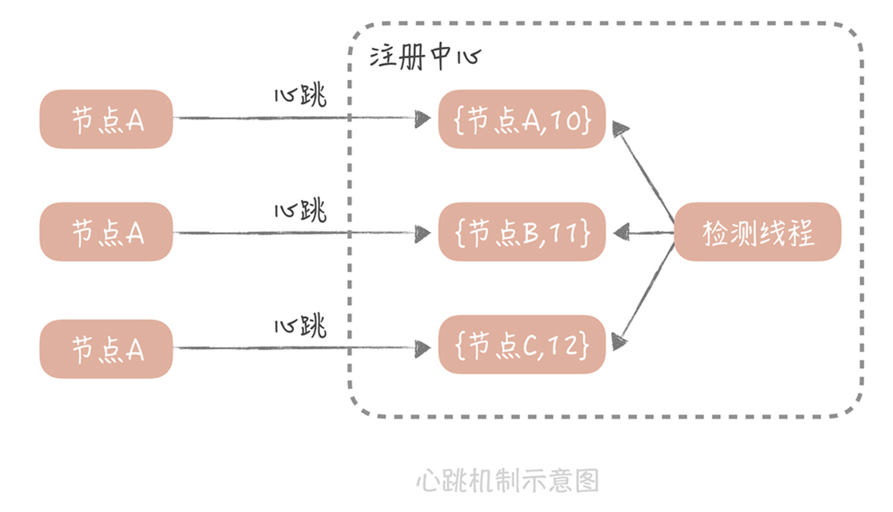
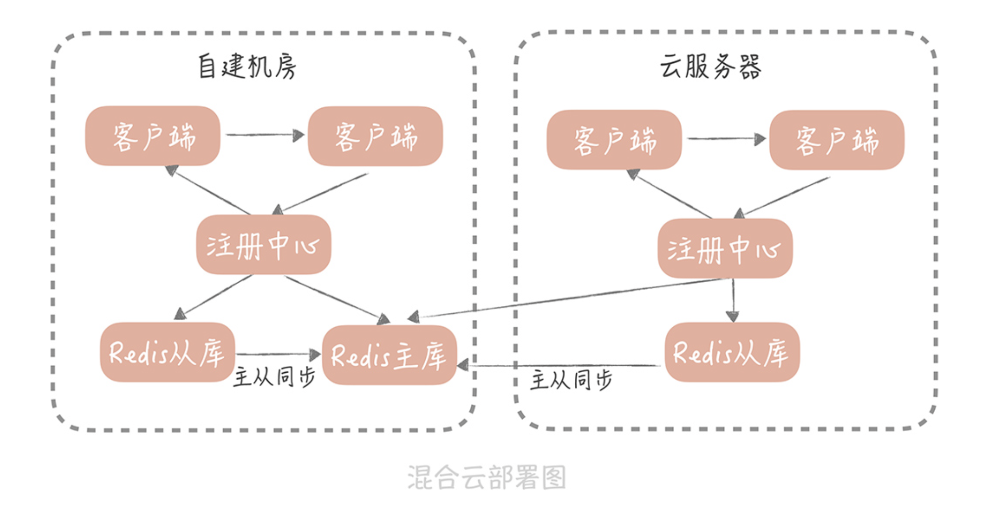

# 服务注册与发现

目前业界有很多可供你来选择的注册中心组件，比如说老派的 ZooKeeper，Kubernetes 使用的 ETCD，阿里的微服务注册中心 Nacos，Spring Cloud 的 Eureka 等等。

这些注册中心的基本功能有两点：

- 其一是提供了服务地址的存储；
- 其二是当存储内容发生变化时，可以将变更的内容推送给客户端。

第二个功能是我们使用注册中心的主要原因。因为无论是，当我们需要紧急扩容，还是在服务器发生故障时，需要快速摘除节点，都不用重启服务器就可以实现了。

## 服务状态管理

**1.主动探测**

你的 RPC 服务要打开一个端口，然后由注册中心每隔一段时间（比如 30 秒）探测这些端口是否可用，如果可用就认为服务仍然是正常的，否则就可以认为服务不可用，那么注册中心就可以把服务从列表里面删除了。

主动探测会有两个问题：

**第一个问题是：** 所有的 RPC 服务端都需要，开放一个统一的端口给注册中心探测，那时候还没有容器化，一台物理机上会混合部署很多的服务，你需要开放的端口很可能已经被占用，这样会造成 RPC 服务启动失败。

**还有一个问题是：** 如果 RPC 服务端部署的实例比较多，那么每次探测的成本也会比较高，探测的时间也比较长，这样当一个服务不可用时，可能会有一段时间的延迟，才会被注册中心探测到。

**2.心跳模式**

这也是大部分注册中心提供的，检测连接上来的 RPC 服务端是否存活的方式，比如 Eureka、ZooKeeper， **在我来看，这种心跳机制可以这样实现：**

注册中心为每一个连接上来的 RPC 服务节点，**记录最近续约的时间** ，RPC 服务节点在启动注册到注册中心后，就按照一定的时间间隔（比如 30 秒），向注册中心发送心跳包。注册中心在接受到心跳包之后，会更新这个节点的最近续约时间。然后，注册中心会启动一个定时器，定期检测当前时间和节点，最近续约时间的差值，如果达到一个阈值（比如说 90 秒），那么认为这个服务节点不可用。

**在实际的使用中，** 心跳机制相比主动探测的机制，适用范围更广，如果你的服务也需要检测是否存活，那么也可以考虑使用心跳机制来检测。

**接着说回来， ** 有了心跳机制之后，注册中心就可以管理注册的服务节点的状态了，也让你的注册中心成为了整体服务最重要的组件，因为一旦它出现问题或者代码出现 Bug，那么很可能会导致整个集群的故障，给你举一个真实的案例。

**在我之前的一个项目中，** 工程是以「混合云」的方式部署的，也就是一部分节点部署在自建机房中，一部分节点部署在云服务器上，每一个机房都部署了自研的一套注册中心，每套注册中心中都保存了全部节点的数据。

这套自研的注册中心使用 Redis 作为最终的存储，而在自建机房和云服务器上的注册中心，共用同一套 Redis 存储资源。由于「混合云」还处在测试阶段，所以，所有的流量还都在自建机房，自建机房和云服务器之前的专线带宽还比较小，部署结构如下：

在测试的过程中，系统运行稳定，但是某一天早上五点，我突然发现，所有的服务节点都被摘除了，客户端因为拿不到服务端的节点地址列表全部调用失败，整体服务宕机。经过排查我发现，云服务器上部署的注册中心，竟然将所有的服务节点全部删除了！进一步排查之后， **原来是自研注册中心出现了 Bug。**

在正常的情况下，无论是自建机房，还是云服务器上的服务节点，都会向各自机房的注册中心注册地址信息，并且发送心跳。而这些地址信息，以及服务的最近续约时间，都是存储在 Redis 主库中，各自机房的注册中心，会读各自机房的从库来获取最近续约时间，从而判断服务节点是否有效。

Redis 的主从同步数据是通过专线来传输的，出现故障之前，专线带宽被占满，导致主从同步延迟。这样一来，云上部署的 Redis 从库中存储的最近续约时间，就没有得到及时更新，随着主从同步延迟越发严重，最终，云上部署的注册中心发现了，当前时间与最近续约时间的差值，超过了摘除的阈值，所以将所有的节点摘除，从而导致了故障。

有了这次惨痛的教训， **我们给注册中心增加了保护的策略：** 如果摘除的节点占到了服务集群节点数的 40%，就停止摘除服务节点，并且给服务的开发同学和，运维同学报警处理（这个阈值百分比可以调整，保证了一定的灵活性）。

**据我所知，** Eureka 也采用了类似的策略，来避免服务节点被过度摘除，导致服务集群不足以承担流量的问题。如果你使用的是 ZooKeeper 或者 ETCD 这种无保护策略的分布式一致性组件，那你可以考虑在客户端，实现保护策略的逻辑，比如说当摘除的节点超过一定比例时，你在 RPC 客户端就不再处理变更通知，你可以依据自己的实际情况来实现。