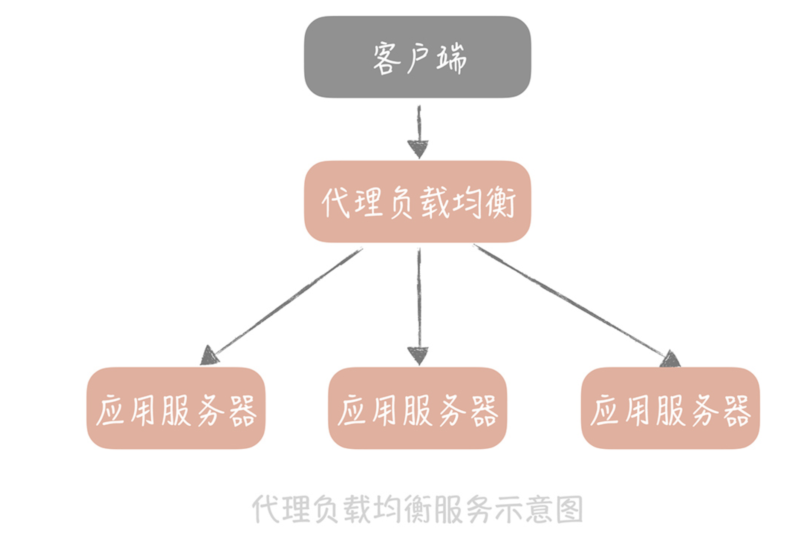
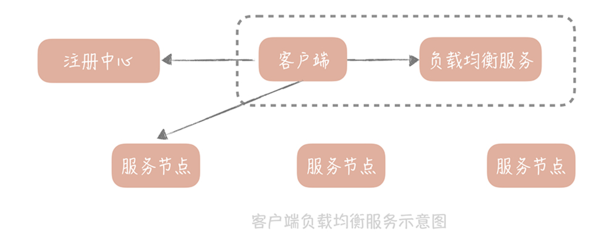

# 负载均衡

负载均衡服务大体上可以分为两大类：一类是 **代理类的负载均衡服务** ；另一类是 **客户端负载均衡服务** 。

## 代理类的负载均衡

代理类的负载均衡服务，以单独的服务方式部署，所有的请求都要先经过负载均衡服务，在负载均衡服务中，选出一个合适的服务节点后，再由负载均衡服务，调用这个服务节点来实现流量的分发。

由于这类服务需要承担全量的请求，所以对于性能的要求极高。代理类的负载均衡服务有很多开源实现，比较著名的有 LVS，Nginx 等等。LVS 在 OSI 网络模型中的第四层，传输层工作，所以 LVS 又可以称为四层负载；而 Nginx 运行在 OSI 网络模型中的第七层，应用层，所以又可以称它为七层负载。

在项目的架构中，我们一般会同时部署 LVS 和 Nginx 来做 HTTP 应用服务的负载均衡。也就是说，在入口处部署 LVS，将流量分发到多个 Nginx 服务器上，再由 Nginx 服务器分发到应用服务器上， **为什么这么做呢？**

主要和 LVS 和 Nginx 的特点有关，LVS 是在网络栈的四层做请求包的转发，请求包转发之后，由客户端和后端服务直接建立连接，后续的响应包不会再经过 LVS 服务器，所以相比 Nginx，性能会更高，也能够承担更高的并发。

可 LVS 缺陷是工作在四层，而请求的 URL 是七层的概念，不能针对 URL 做更细致地请求分发，而且 LVS 也没有提供探测后端服务是否存活的机制；而 Nginx 虽然比 LVS 的性能差很多，但也可以承担每秒几万次的请求，并且它在配置上更加灵活，还可以感知后端服务是否出现问题。

因此，LVS 适合在入口处，承担大流量的请求分发，而 Nginx 要部署在业务服务器之前做更细维度的请求分发。

不过这两个负载均衡服务适用于普通的 Web 服务，对于微服务架构来说，它们是不合适的。因为微服务架构中的服务节点存储在注册中心里，使用 LVS 就很难和注册中心交互，获取全量的服务节点列表。另外，一般微服务架构中，使用的是 RPC 协议而不是 HTTP 协议，所以 Nginx 也不能满足要求。

## 客户端负载均衡

**所以，我们会使用另一类的负载均衡服务，客户端负载均衡服务，也就是把负载均衡的服务内嵌在 RPC 客户端中。**

它一般和客户端应用，部署在一个进程中，提供多种选择节点的策略，最终为客户端应用提供一个最佳的，可用的服务端节点。这类服务一般会结合注册中心来使用，注册中心提供服务节点的完整列表，客户端拿到列表之后使用负载均衡服务的策略选取一个合适的节点，然后将请求发到这个节点上。

## 负载均衡策略

负载均衡策略从大体上来看可以分为两类：

- 一类是静态策略，也就是说负载均衡服务器在选择服务节点时，不会参考后端服务的实际运行的状态。
- 一类是动态策略，也就是说负载均衡服务器会依据后端服务的一些负载特性，来决定要选择哪一个服务节点。

**静态策略**

常见的静态策略有几种，其中使用最广泛的是 **轮询的策略（RoundRobin，RR），** 这种策略会记录上次请求后端服务的地址或者序号，然后在请求时，按照服务列表的顺序，请求下一个后端服务节点。

它其实是一种通用的策略，基本上，大部分的负载均衡服务器都支持。轮询的策略可以做到将请求尽量平均地分配到所有服务节点上，但是，它没有考虑服务节点的具体配置情况。比如，你有三个服务节点，其中一个服务节点的配置是 8 核 8G，另外两个节点的配置是 4 核 4G，那么如果使用轮询的方式来平均分配请求的话，8 核 8G 的节点分到的请求数量和 4 核 4G 的一样多，就不能发挥性能上的优势了

所以，我们考虑给节点加上权重值，比如给 8 核 8G 的机器配置权重为 2，那么就会给它分配双倍的流量， **这种策略就是带有权重的轮询策略。**

除了这两种策略之外，目前开源的负载均衡服务还提供了很多静态策略：

- Nginx 提供了 ip_hash 和 url_hash 算法；
- LVS 提供了按照请求的源地址，和目的地址做 hash 的策略；
- Dubbo 也提供了随机选取策略，以及一致性 hash 的策略。

**但是在我看来，** 轮询和带有权重的轮询策略，能够将请求尽量平均地分配到后端服务节点上，也就能够做到对于负载的均衡分配，在没有更好的动态策略之前，应该优先使用这两种策略，比如 Nginx 就会优先使用轮询的策略。

**动态策略**

而目前开源的负载均衡服务中，也会提供一些动态策略，我强调一下它们的原理。

在负载均衡服务器上会收集对后端服务的调用信息，比如从负载均衡端到后端服务的活跃连接数，或者是调用的响应时间，然后从中选择连接数最少的服务，或者响应时间最短的后端服务。 **我举几个具体的例子：**

- Dubbo 提供的 LeastAcive 策略，就是优先选择活跃连接数最少的服务；
- Spring Cloud 全家桶中的 Ribbon 提供了 WeightedResponseTimeRule 是使用响应时间，给每个服务节点计算一个权重，然后依据这个权重，来给调用方分配服务节点。

**这些策略的思考点 ** 是从调用方的角度出发，选择负载最小、资源最空闲的服务来调用，以期望能得到更高的服务调用性能，也就能最大化地使用服务器的空闲资源，请求也会响应地更迅速， **所以，我建议你，** 在实际开发中，优先考虑使用动态的策略。