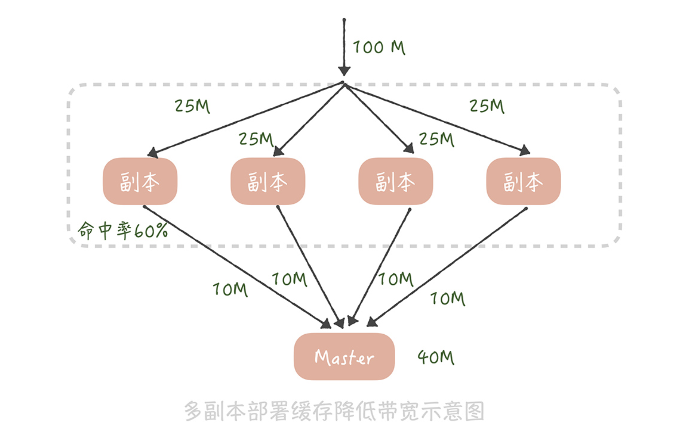
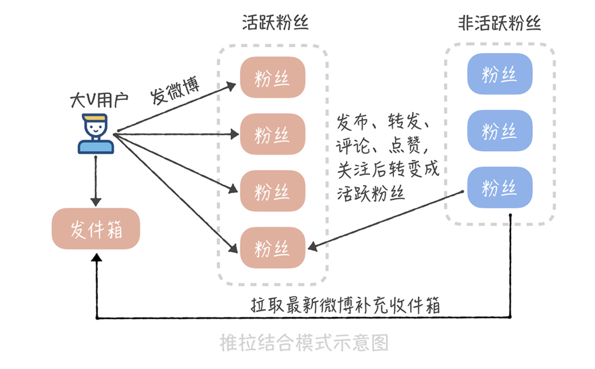

# 信息流系统的拉模式

## 拉模式

所谓拉模式，就是指用户主动拉取他关注的所有人的微博，将这些微博按照发布时间的倒序进行排序和聚合之后，生成信息流数据的方法。

按照这个思路实现微博信息流系统的时候你会发现：用户的收件箱不再有用，因为信息流数据不再出自收件箱，而是出自发件箱。发件箱里是用户关注的所有人数据的聚合。因此用户在发微博的时候就只需要写入自己的发件箱，而不再需要推送给粉丝的收件箱了，这样在获取信息流的时候，就要查询发件箱的数据了。

这个逻辑我还用 SQL 的形式直观地表达出来，方便你理解。假设用户 A 关注了用户 B、C、D，那么当用户 B 发送一条微博的时候，他会执行这样的操作：

```sql
insert into outbox(userId, feedId, create_time) values("B", $feedId, $current_time); // 写入 B 的发件箱
```

当用户 A 想要获取他的信息流的时候，就要聚合 B、C、D 三个用户收件箱的内容了：

```sql
select feedId from outbox where userId in (select userId from follower where fanId = "A") order by create_time desc
```

**你看，拉模式的实现思想并不复杂，并且相比推模式来说，它有几点明显的优势。**

首先，拉模式彻底解决了推送延迟的问题，大 V 发微博的时候不再需要推送到粉丝的收件箱，自然就不存在延迟的问题了。

其次，存储成本大大降低了。在推模式下，谢娜的粉丝有 1.2 亿，那么谢娜发送一条微博就要被复制 1.2 亿条，写入到存储系统中。在拉模式下只保留了发件箱，微博数据不再需要复制，成本也就随之降低了。

最后，功能扩展性更好了。比如，微博增加了分组的功能，而你想把关注的 A 和 B 分成一个单独的组，那么 A 和 B 发布的微博就形成了一个新的信息流，这个信息流要如何实现呢？很简单，你只需要查询这个分组下所有用户（也就是 A 和 B），然后查询这些用户的发件箱，再把发件箱中的数据，按照时间倒序重新排序聚合就好了。

```java
List<Long> uids = getFromGroup(groupId); // 获取分组下的所有用户
Long<List<Long>> ids = new ArrayList<List<Long>>();
for(Long id : uids) {
  ids.add(getOutboxByUid(id)); // 获取发件箱的内容 id 列表
}
return merge(ids); // 合并排序所有的 id
```

拉模式之所以可以解决推模式下的所有问题，是因为在业务上关注数始终是有上限的，那么它是不是一个无懈可击的方案呢？ **当然不是，拉模式也会有一些问题，在我看来主要有这样两点。**

第一点，不同于推模式下获取信息流的时候，只是简单地查询收件箱中的数据，在拉模式下，我们需要对多个发件箱的数据做聚合，这个查询和聚合的成本比较高。微博的关注上限是 2000，假如你关注了 2000 人，就要查询这 2000 人发布的微博信息，然后再对查询出来的信息做聚合。

那么，如何保证在毫秒级别完成这些信息的查询和聚合呢？答案还是缓存。我们可以把用户发布的微博 ID 放在缓存中，不过如果把全部用户的所有微博都缓存起来，消耗的硬件成本也是很高的。所以我们需要关注用户浏览信息流的特点，看看是否可能对缓存的存储成本做一些优化。

在实际执行中，**我们对用户的浏览行为做了抽量分析，发现 97% 的用户都是在浏览最近 5 天之内的微博** ，也就是说，用户很少翻看五天之前的微博内容，所以我们只缓存了每个用户最近 5 天发布的微博 ID。假设我们部署 6 个缓存节点来存储这些微博 ID，在每次聚合时并行从这几个缓存节点中批量查询多个用户的微博 ID，获取到之后再在应用服务内存中排序后就好了，这就是对缓存的 6 次请求，可以保证在 5 毫秒之内返回结果。

第二，缓存节点的带宽成本比较高。你想一下，假设微博信息流的访问量是每秒 10 万次请求，也就是说，每个缓存节点每秒要被查询 10 万次。假设一共部署 6 个缓存节点，用户人均关注是 90，平均来说每个缓存节点要存储 15 个用户的数据。如果每个人平均每天发布 2 条微博，5 天就是发布 10 条微博，15 个用户就要存储 150 个微博 ID。每个微博 ID 要是 8 个字节，150 个微博 ID 大概就是 1kB 的数据，单个缓存节点的带宽就是 1kB * 10 万 = 100MB，基本上跑满了机器网卡带宽了。 **那么我们要如何对缓存的带宽做优化呢？**

在14 讲中我提到，部署多个缓存副本提升缓存可用性，其实，缓存副本也可以分摊带宽的压力。我们知道在部署缓存副本之后，请求会先查询副本中的数据，只有不命中的请求才会查询主缓存的数据。假如原本缓存带宽是 100M，我们部署 4 组缓存副本，缓存副本的命中率是 60%，那么主缓存带宽就降到 100M * 40% = 40M，而每组缓存副本的带宽为 100M / 4 = 25M，这样每一组缓存的带宽都降为可接受的范围之内了。



在经过了上面的优化之后，基本上完成了基于拉模式信息流系统方案的设计，你在设计自己的信息流系统时可以参考借鉴这个方案。另外，使用缓存副本来抗流量也是一种常见的缓存设计思路，你在项目中必要的时候也可以使用。


## 推拉结合

但是，有的同学可能会说：我在系统搭建初期已经基于推模式实现了一套信息流系统，如果把它推倒重新使用拉模式实现的话，系统的改造成本未免太高了。有没有一种基于推模式的折中的方案呢？

其实我在网易微博的时候，网易微博的信息流就是基于推模式来实现的，当用户的粉丝量大量上涨之后， **我们通过对原有系统的改造实现了一套推拉结合的方案，也能够基本解决推模式存在的问题，具体怎么做呢？**

方案的核心在于大 V 用户在发布微博的时候，不再推送到全量用户，而是只推送给活跃的用户。这个方案在实现的时候有几个关键的点。

首先，**我们要如何判断哪些是大 V 用户呢？** 或者说，哪些用户在发送微博时需要推送全量用户，哪些用户需要推送活跃用户呢？在我看来，还是应该以粉丝数作为判断标准，比如，粉丝数超过 50 万就算作大 V，需要只推送活跃用户。

其次，**我们要如何标记活跃用户呢？** 活跃用户可以定义为最近几天内在微博中有过操作的用户，比如说刷新过信息流、发布过微博、转发评论点赞过微博，关注过其他用户等等，一旦有用户有过这些操作，我们就把他标记为活跃的用户。

而对大 V 来说，我们可以存储一个活跃粉丝的列表，这个列表里面就是我们标记的活跃用户。当某一个用户从不活跃用户变为活跃用户时，我们会查询这个用户的关注者中哪些是大 V，然后把这个用户写入到这些大 V 的活跃粉丝列表里面，这个活跃粉丝列表是定长的，如果活跃粉丝数量超过了长度，就把最先加入的粉丝从列表里剔除，这样可以保证推送的效率。

最后，一个用户被从活跃粉丝列表中剔除，或者是他从不活跃变成了活跃后，由于他不在大 V 用户的活跃粉丝列表中，所以也就不会收到微博的实时推送，因此，我们需要异步地把大 V 用户最近发布的微博插入到他的收件箱中，保证他的信息流数据的完整性。



采用推拉结合的方式可以一定程度上弥补推模式的缺陷，不过也带来了一些维护的成本，比如说系统需要维护用户的在线状态，还需要多维护一套活跃的粉丝列表数据，在存储上的成本就更高了。

因此，这种方式一般适合中等体量的项目，当粉丝量级在百万左右，活跃粉丝数量在 10 万级别时，一般可以实现比较低的信息传播延迟以及信息流获取延迟，但是当你的粉丝数量继续上涨，流量不断提升之后，无论是活跃粉丝的存储还是推送的延迟都会成为瓶颈，所以改成拉模式会更好的支撑业务。


## 总结

1. 在拉模式下，我们只需要保存用户的发件箱，用户的信息流是通过 **聚合关注者发件箱数据** 来实现的；
2. 拉模式会有比较大的聚合成本，缓存节点也会存在带宽的瓶颈，所以我们可以通过一些权衡策略尽量减少获取数据的大小，以及部署缓存副本的方式来抗并发；
3. 推拉结合的模式核心是只推送活跃的粉丝用户，需要维护用户的在线状态以及活跃粉丝的列表，所以需要增加多余的空间成本来存储，这个你需要来权衡。

拉模式和推拉结合模式比较适合微博这种粉丝量很大的业务场景，因为它们都会有比较可控的消息推送延迟。你可以看到，在这两节课程中我们灵活使用数据库分库分表、缓存消息队列、发号器等技术，实现了基于推模式、拉模式以及推拉结合模式的信息流系统，你在做自己系统的方案设计时，应该充分发挥每种技术的优势，权衡业务自身的特性，最终实现技术和业务上的平衡，也就是既能在业务上满足用户需求，又能在技术上保证系统的高性能和高可用。

