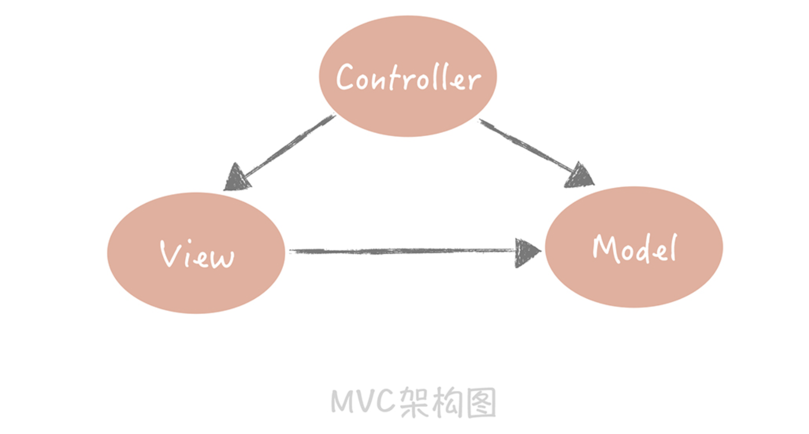
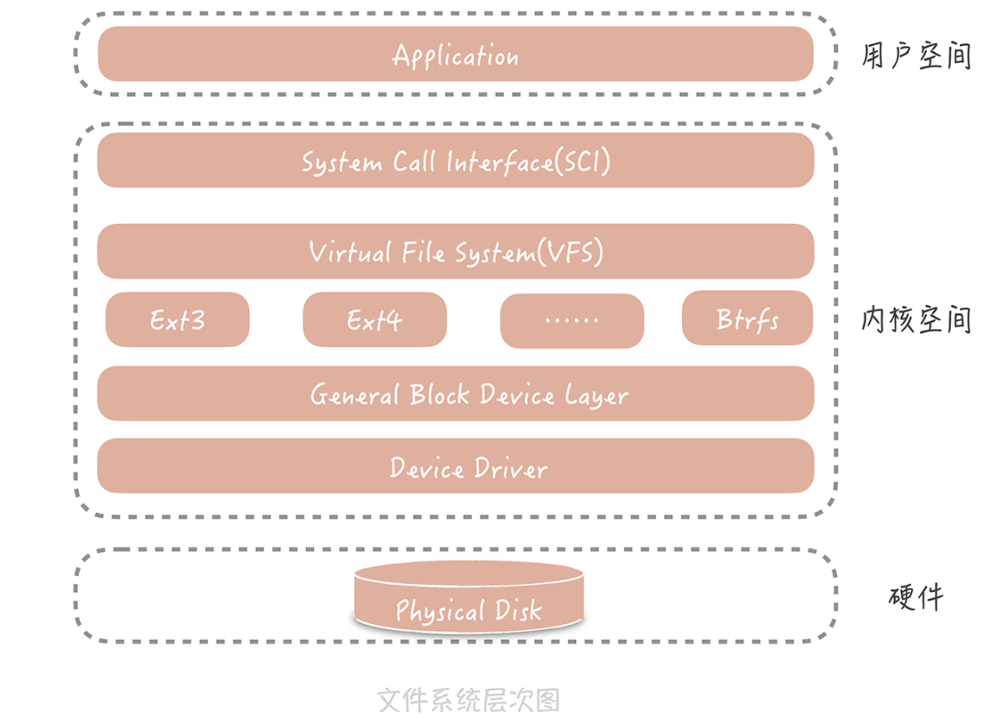

# 分层架构

**常见分层架构**

**架构分层：**

MVC架构，它将整体的系统分成了 Model（模型），View（视图）和 Controller（控制器）三个层次，也就是将用户视图和业务处理隔离开，并且通过控制器连接起来，很好地实现了 **表现和逻辑的解耦**，是一种标准的软件分层架构。

另外一种常见的分层方式是将整体架构分为表现层、逻辑层和数据访问层：

- 表现层，顾名思义嘛，就是展示数据结果和接受用户指令的，是最靠近用户的一层；
  
- 逻辑层里面有复杂业务的具体实现；
  
- 数据访问层则是主要处理和存储之间的交互。

这是在架构上最简单的一种分层方式。比如在构建项目的时候，我们通常会建立三个目录：Web、Service 和 Dao，它们分别对应了表现层、逻辑层还有数据访问层。

参照阿里发布的[《阿里巴巴 Java 开发手册 v1.4.0（详尽版）》 (opens new window)](https://yq.aliyun.com/articles/69327)，我们可以将原先的三层架构细化成下面的样子：

解释如下：

- 终端显示层：

  各端模板渲染并执行显示的层。当前主要是 Velocity 渲染，JS 渲染， JSP 渲染，移动端展示等。

- 开放接口层：

  将 Service 层方法封装成开放接口，同时进行网关安全控制和流量控制等。

- Web 层：

  主要是对访问控制进行转发，各类基本参数校验，或者不复用的业务简单处理等。

- Service 层：业务逻辑层。

- Manager 层：

  通用业务处理层。这一层主要有两个作用：

  - 其一，你可以将原先 Service 层的一些通用能力下沉到这一层，比如 **与缓存和存储交互策略**，中间件的接入；
  - 其二，你也可以在这一层 **封装对第三方接口的调用，比如调用支付服务，调用审核服务等**。

- DAO 层：

  数据访问层，与底层 MySQL、Oracle、Hbase 等进行数据交互。

- 外部接口或第三方平台：

  包括其它部门 RPC 开放接口，基础平台，其它公司的 HTTP 接口。

在这个分层架构中 **主要增加了 Manager 层**，它与 Service 层的关系是：**Manager 层提供原子的服务接口，Service 层负责依据业务逻辑来编排原子接口**。举例来说，Manager 层提供 **创建用户** 和 **获取用户信息** 的接口，而 Service 层负责将这两个接口组装起来。这样就把原先散布在表现层的业务逻辑都统一到了 Service 层，每一层的边界就非常清晰了。

**层次之间一定是相邻层互相依赖**，**数据的流转也只能在相邻的两层之间流转**。

除此之外，还有 OSI 网络模型，它把整个网络分了七层，自下而上分别是物理层、数据链路层、网络层、传输层、会话层、表示层和应用层。工作中经常能用到 TCP/IP 协议，它把网络简化成了四层(如上图右侧)，即链路层、网络层、传输层和应用层。每一层各司其职又互相帮助，网络层负责端到端的寻址和建立连接，传输层负责端到端的数据传输等，同时呢相邻两层还会有数据的交互。这样可以 隔离关注点，让不同的层专注做不同的事情。

Linux 文件系统也是分层设计的，从下图你可以清晰地看出文件系统的层次。

- 在文件系统的最上层是 虚拟文件系统（VFS），用来屏蔽不同的文件系统之间的差异，提供统一的系统调用接口。

- 虚拟文件系统的下层是 Ext3、Ext4 等各种文件系统

- 再向下是为了屏蔽不同硬件设备的实现细节，我们抽象出来的单独的一层——通用块设备层，

- 然后就是不同类型的磁盘了。

我们可以看到，某些层次负责的是对下层不同实现的抽象，从而对上层屏蔽实现细节。比方说 VFS 对上层（系统调用层）来说提供了统一的调用接口，同时对下层中不同的文件系统规约了实现模型，当新增一种文件系统实现的时候，只需要按照这种模型来设计，就可以无缝插入到 Linux 文件系统中。

**分层的好处**

**分层的设计可以简化系统设计，让不同的人专注做某一层次的事情。** 想象一下，如果你要设计一款网络程序却没有分层，该是一件多么痛苦的事情。

因为你必须是一个通晓网络的全才，要知道各种网络设备的接口是什么样的，以便可以将数据包发送给它。你还要关注数据传输的细节，并且需要处理类似网络拥塞，数据超时重传这样的复杂问题。当然了，你更需要关注数据如何在网络上安全传输，不会被别人窥探和篡改。

而有了分层的设计，你只需要专注设计应用层的程序就可以了，其他的，都可以交给下面几层来完成。

**再有，分层之后可以做到很高的复用。** 比如，我们在设计系统 A 的时候，发现某一层具有一定的通用性，那么我们可以把它抽取独立出来，在设计系统 B 的时候使用起来，这样可以减少研发周期，提升研发的效率。

**最后一点，分层架构可以让我们更容易做横向扩展。** 如果系统没有分层，当流量增加时我们需要针对整体系统来做扩展。但是，如果我们按照上面提到的三层架构将系统分层后，那么我们就可以针对具体的问题来做细致的扩展。

比如说，业务逻辑里面包含有比较复杂的计算，导致 CPU 成为性能的瓶颈，那这样就可以把逻辑层单独抽取出来独立部署，然后只对逻辑层来做扩展，这相比于针对整体系统扩展所付出的代价就要小的多了。

**分层的缺点**

任何事物都不可能是尽善尽美的，分层架构虽有优势也会有缺陷，它最主要的一个缺陷就是**增加了代码的复杂度。**

这是显而易见的嘛，明明可以在接收到请求后就可以直接查询数据库获得结果，却偏偏要在中间插入多个层次，并且有可能每个层次只是简单地做数据的传递。有时增加一个小小的需求也需要更改所有层次上的代码，看起来增加了开发的成本，并且从调试上来看也增加了复杂度，原本如果直接访问数据库我只需要调试一个方法，现在我却要调试多个层次的多个方法。

另外一个可能的缺陷是，如果我们把每个层次独立部署，层次间通过网络来交互，那么多层的架构在性能上会有损耗。这也是为什么服务化架构性能要比单体架构略差的原因，也就是所谓的 **多一跳** 问题。