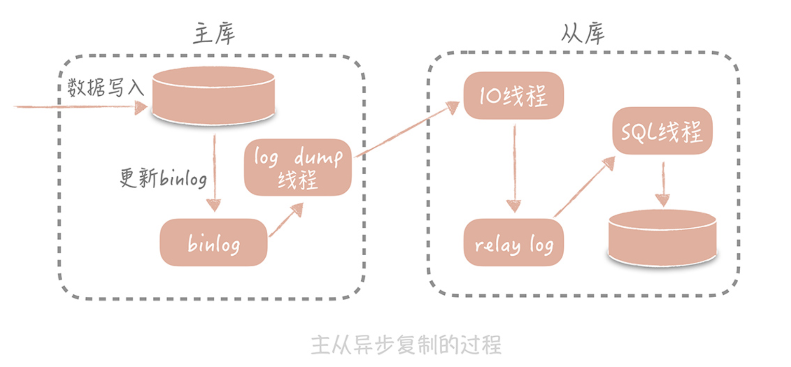
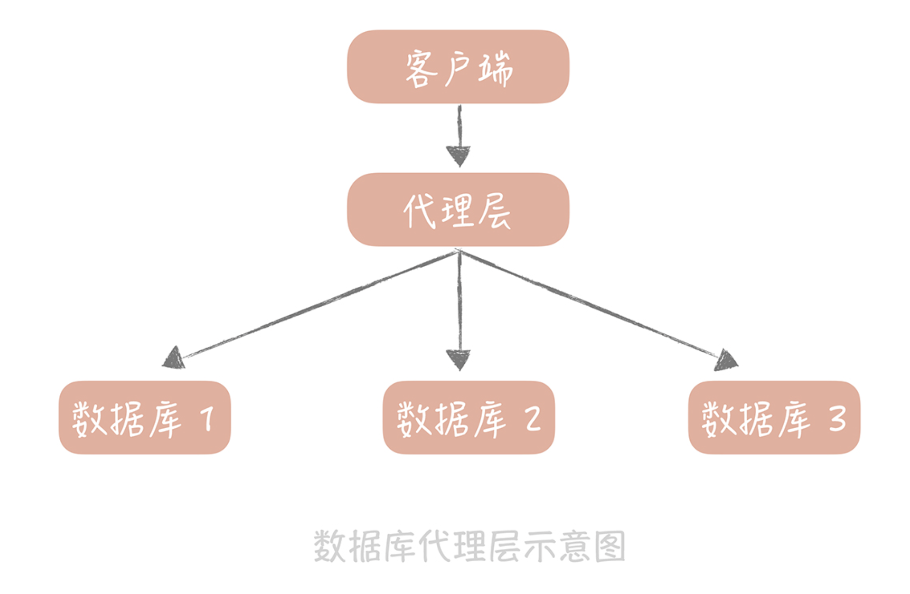

# 主从分离

## MySQL主从分离

MySQL 的主从复制是依赖于 binlog 的，也就是记录 MySQL 上的所有变化并以二进制形式保存在磁盘上二进制日志文件。**主从复制就是将 binlog 中的数据从主库传输到从库上 ** ，一般这个过程是异步的，即主库上的操作不会等待 binlog 同步的完成。

**主从复制的过程是这样的： **

1.首先从库在连接到主节点时会创建一个 IO 线程，用以请求主库更新的 binlog，并且把接收到的 binlog 信息写入一个叫做 relay log 的日志文件中
2.而主库也会创建一个 log dump 线程来发送 binlog 给从库；
3.同时，从库还会创建一个 SQL 线程读取 relay log 中的内容，并且在从库中做回放，最终实现主从的一致性。这是一种比较常见的主从复制方式。

## 主从延迟问题

在发微博的过程中会有些同步的操作，像是更新数据库的操作，也有一些异步的操作，比如说将微博的信息同步给审核系统，所以我们在更新完主库之后，会将微博的 ID 写入消息队列，再由队列处理机依据 ID 在从库中获取微博信息再发送给审核系统。 **此时如果主从数据库存在延迟，会导致在从库中获取不到微博信息，整个流程会出现异常。**

这个问题解决的思路有很多，**核心思想就是尽量不去从库中查询信息** ，纯粹以上面的例子来说，我就有三种解决方案：

1.**第一种方案是数据的冗余。**

   你可以在发送消息队列时不仅仅发送微博 ID，而是发送队列处理机需要的所有微博信息，借此避免从数据库中重新查询数据。

2.**第二种方案是使用缓存。**

   我可以在同步写数据库的同时，也把微博的数据写入到 Memcached 缓存里面，这样队列处理机在获取微博信息的时候会优先查询缓存，这样也可以保证数据的一致性。

3.**最后一种方案是查询主库。**

   我可以在队列处理机中不查询从库而改为查询主库。不过，这种方式使用起来要慎重，要明确查询的量级不会很大，是在主库的可承受范围之内，否则会对主库造成比较大的压力。

## 如何访问数据库？

我们已经使用主从复制的技术将数据复制到了多个节点，也实现了数据库读写的分离，这时，对于数据库的使用方式发生了变化。以前只需要使用一个数据库地址就好了，现在需要使用一个主库地址和多个从库地址，并且需要区分写入操作和查询操作，如果结合下一节课中要讲解的内容 **分库分表**，复杂度会提升更多。 **为了降低实现的复杂度，业界涌现了很多数据库中间件来解决数据库的访问问题，这些中间件可以分为两类。**

1.第一类以淘宝的 TDDL（ Taobao Distributed Data Layer）为代表，**以代码形式内嵌运行在应用程序内部**。

   你可以把它看成是一种数据源的代理，它的配置管理着多个数据源，每个数据源对应一个数据库，可能是主库，可能是从库。当有一个数据库请求时，中间件将 SQL 语句发给某一个指定的数据源来处理，然后将处理结果返回。

   这一类中间件的优点是简单易用，没有多余的部署成本，因为它是植入到应用程序内部，与应用程序一同运行的，所以比较适合运维能力较弱的小团队使用；缺点是缺乏多语言的支持，目前业界这一类的主流方案除了 TDDL，还有早期的网易 DDB，它们都是 Java 语言开发的，无法支持其他的语言。另外，版本升级也依赖使用方更新，比较困难。

2.另一类是单独部署的代理层方案

   这一类方案代表比较多，如早期阿里巴巴开源的 Cobar，基于 Cobar 开发出来的 Mycat，360 开源的 Atlas，美团开源的基于 Atlas 开发的 DBProxy 等等。

   这一类中间件部署在独立的服务器上，业务代码如同在使用单一数据库一样使用它，实际上它内部管理着很多的数据源，当有数据库请求时，它会对 SQL 语句做必要的改写，然后发往指定的数据源。

   它一般使用标准的 MySQL 通信协议，所以可以很好地支持多语言。由于它是独立部署的，所以也比较方便进行维护升级，比较适合有一定运维能力的大中型团队使用。它的缺陷是所有的 SQL 语句都需要跨两次网络：从应用到代理层和从代理层到数据源，所以在性能上会有一些损耗。

