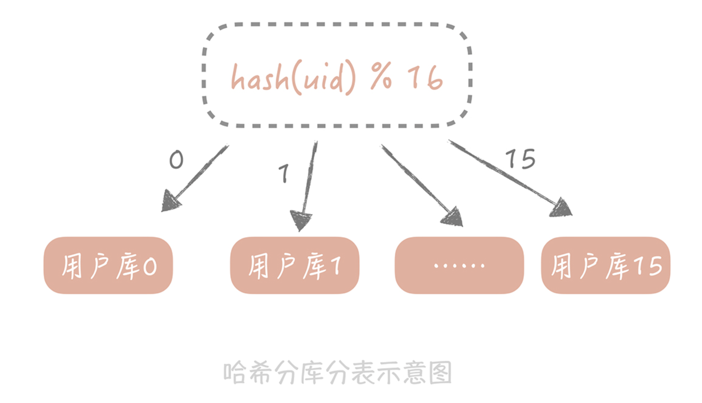
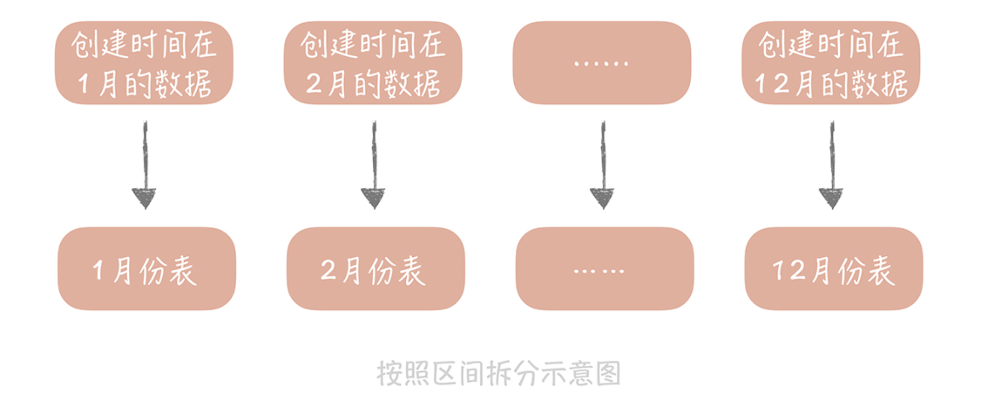

# 分库分表

## 垂直拆分

顾名思义就是对数据库竖着拆分，也就是将数据库的 **表拆分到多个不同的数据库中**。

在微博系统中有和用户相关的表，有和内容相关的表，有和关系相关的表，这些表都存储在主库中。在拆分后，我们期望用户相关的表分拆到用户库中，内容相关的表分拆到内容库中，关系相关的表分拆到关系库中。

## 水平拆分

拆分的规则有下面这两种：

- 按照某一个字段的 **哈希值** 做拆分

  这种拆分规则比较适用于实体表，比如说用户表，内容表，我们一般按照这些实体表的 ID 字段来拆分。比如说我们想把用户表拆分成 16 个库，64 张表，那么可以先对用户 ID 做哈希，哈希的目的是将 ID 尽量打散，然后再对 16 取余，这样就得到了分库后的索引值；对 64 取余，就得到了分表后的索引值。

- 另一种比较常用的是按照某一个字段的 **区间** 来拆分，比较常用的是时间字段。

  你知道在内容表里面有「创建时间」的字段，而我们也是按照时间来查看一个人发布的内容。我们可能会要看昨天的内容，也可能会看一个月前发布的内容，这时就可以按照创建时间的区间来分库分表，比如说可以把一个月的数据放入一张表中，这样在查询时就可以根据创建时间先定位数据存储在哪个表里面，再按照查询条件来查询。

  一般来说，列表数据可以使用这种拆分方式，比如一个人一段时间的订单，一段时间发布的内容。但是这种方式可能会存在明显的热点，这很好理解嘛，你当然会更关注最近我买了什么，发了什么，所以查询的 QPS 也会更多一些，对性能有一定的影响。另外，使用这种拆分规则后，数据表要提前建立好，否则如果时间到了 2020 年元旦，DBA（Database Administrator，数据库管理员）却忘记了建表，那么 2020 年的数据就没有库表可写了，就会发生故障了。

## 分库分表引入的问题

所有的查询都需要带上**分表键**，才能找到数据所在的库和表，如果依其他键查询否则就只能向所有的数据库和数据表发送查询命令。

比如，在用户库中我们使用 ID 作为分区键，这时如果需要按照昵称来查询用户时，**最合适的思路是** 你要建立一个昵称和 ID 的映射表，在查询的时候要先通过昵称查询到 ID，再通过 ID 查询完整的数据，这个表也可以是分库分表的，也需要占用一定的存储空间，但是因为表中只有两个字段，所以相比重新做一次拆分还是会节省不少的空间的。

**分库分表引入的另外一个问题是一些数据库的特性在实现时可能变得很困难。** 比如说多表的 join 在单库时是可以通过一个 SQL 语句完成的，但是拆分到多个数据库之后就无法跨库执行 SQL 了，不过好在我们对于 join 的需求不高，即使有也一般是把两个表的数据取出后在业务代码里面做筛选，复杂是有一些，不过是可以实现的。再比如说在未分库分表之前查询数据总数时只需要在 SQL 中执行 `count()` 即可，现在数据被分散到多个库表中，我们可能要考虑其他的方案，比方说将计数的数据单独存储在一张表中或者记录在 Redis 里面。

