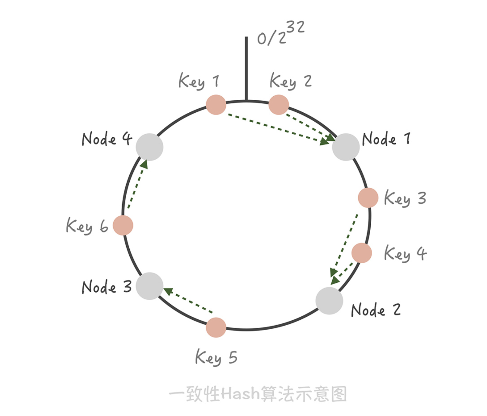
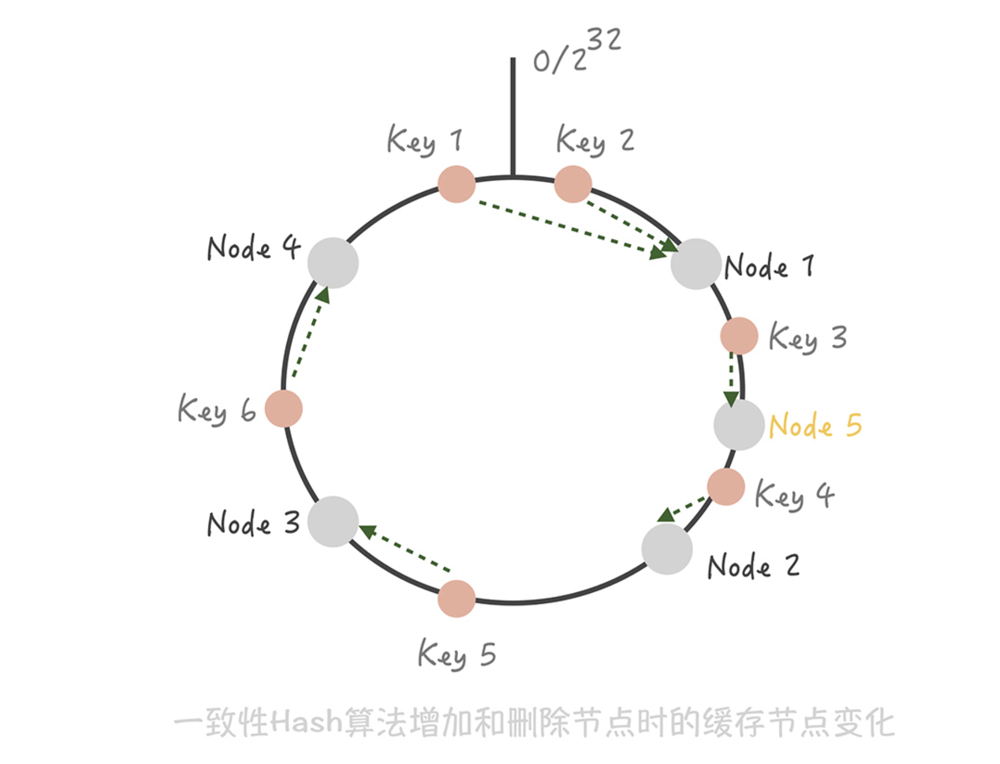

# 数据分片

## 一致性 Hash 算法

**用一致性 Hash 算法可以很好地解决增加和删减节点时，命中率下降的问题。** 在这个算法中，我们将整个 Hash 值空间组织成一个虚拟的圆环，然后将缓存节点的 IP 地址或者主机名做 Hash 取值后，放置在这个圆环上。当我们需要确定某一个 Key 需要存取到哪个节点上的时候，先对这个 Key 做同样的 Hash 取值，确定在环上的位置，然后按照顺时针方向在环上 `行走`，遇到的第一个缓存节点就是要访问的节点。比方说下面这张图里面，Key 1 和 Key 2 会落入到 Node 1 中，Key 3、Key 4 会落入到 Node 2 中，Key 5 落入到 Node 3 中，Key 6 落入到 Node 4 中。

这时如果在 Node 1 和 Node 2 之间增加一个 Node 5，你可以看到原本命中 Node 2 的 Key 3 现在命中到 Node 5，而其它的 Key 都没有变化；同样的道理，如果我们把 Node 3 从集群中移除，那么只会影响到 Key 5 。所以你看， **在增加和删除节点时，只有少量的 Key 会「漂移」到其它节点上，** 而大部分的 Key 命中的节点还是会保持不变，从而可以保证命中率不会大幅下降。

不过，事物总有两面性。虽然这个算法对命中率的影响比较小，但它还是存在问题：

- 缓存节点在圆环上分布不平均，会造成部分缓存节点的压力较大；当某个节点故障时，这个节点所要承担的所有访问都会被顺移到另一个节点上，会对后面这个节点造成压力。
- 一致性 Hash 算法的脏数据问题。

极端情况下，比如一个有三个节点 A、B、C 承担整体的访问，每个节点的访问量平均，A 故障后，B 将承担双倍的压力（A 和 B 的全部请求），当 B 承担不了流量 Crash 后，C 也将因为要承担原先三倍的流量而 Crash，这就造成了整体缓存系统的雪崩。

说到这儿，你可能觉得很可怕，但也不要太担心， **我们程序员就是要能够创造性地解决各种问题，所以你可以在一致性 Hash 算法中引入虚拟节点的概念。**

它将一个缓存节点计算多个 Hash 值分散到圆环的不同位置，这样既实现了数据的平均，而且当某一个节点故障或者退出的时候，它原先承担的 Key 将以更加平均的方式分配到其他节点上，从而避免雪崩的发生。

**其次，就是一致性 Hash 算法的脏数据问题。为什么会产生脏数据呢？** 比方说，在集群中有两个节点 A 和 B，客户端初始写入一个 Key 为 k，值为 3 的缓存数据到 Cache A 中。这时如果要更新 k 的值为 4，但是缓存 A 恰好和客户端连接出现了问题，那这次写入请求会写入到 Cache B 中。接下来缓存 A 和客户端的连接恢复，当客户端要获取 k 的值时，就会获取到存在 Cache A 中的脏数据 3，而不是 Cache B 中的 4。

**所以，在使用一致性 Hash 算法时一定要设置缓存的过期时间，** 这样当发生漂移时，之前存储的脏数据可能已经过期，就可以减少存在脏数据的几率。