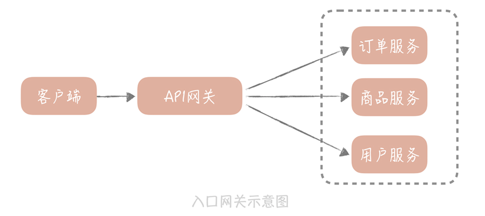
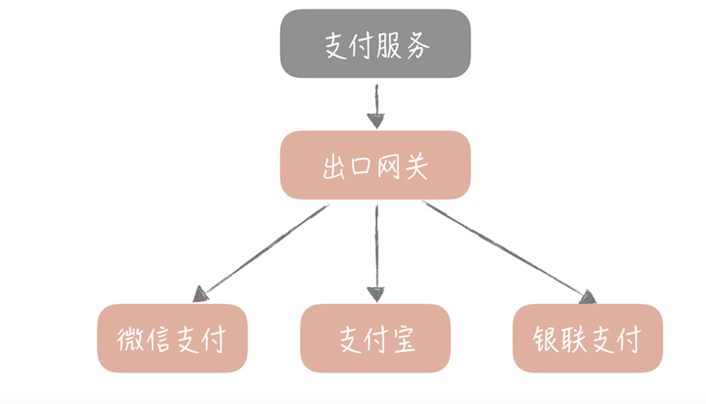
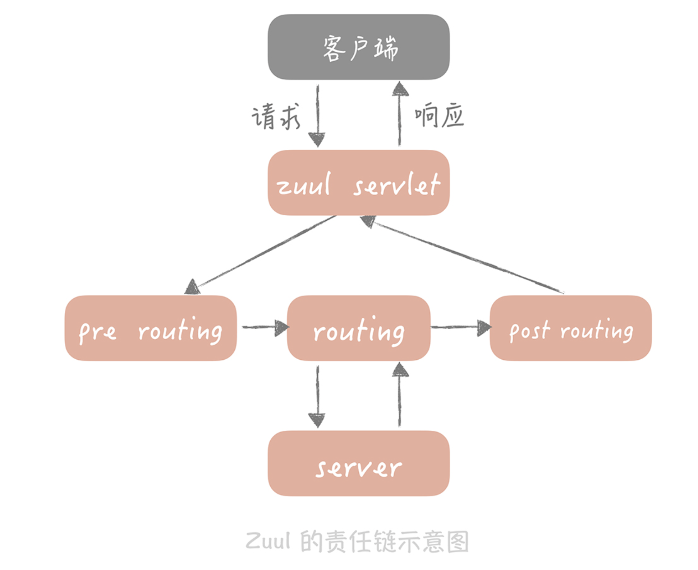

# API网关

API 网关（API Gateway）不是一个开源组件，而是一种架构模式，它是将一些服务共有的功能整合在一起，独立部署为单独的一层，用来解决一些服务治理的问题。你可以把它看作系统的边界，它可以对出入系统的流量做统一的管控。

开源的API网关：

- Kong 是在 Nginx 中运行的 Lua 程序。得益于 Nginx 的性能优势，Kong 相比于其它的开源 API 网关来说，性能方面是最好的。由于大中型公司对于 Nginx 运维能力都比较强，所以选择 Kong 作为 API 网关，无论是在性能还是在运维的把控力上，都是比较好的选择；
- Zuul 是 Spring Cloud 全家桶中的成员，如果你已经使用了 Spring Cloud 中的其他组件，那么也可以考虑使用 Zuul 和它们无缝集成。不过，Zuul1 因为采用同步阻塞模型，所以在性能上并不是很高效，而 Zuul2 推出时间不长，难免会有坑。但是 Zuul 的代码简单易懂，可以很好的把控，并且你的系统的量级很可能达不到 Netfix 这样的级别，所以对于 Java 技术栈的团队，使用 Zuul 也是一个不错的选择；
- Tyk 是一种 Go 语言实现的轻量级 API 网关，有着丰富的插件资源，对于 Go 语言栈的团队来说，也是一种不错的选择。

## API网关分类

在我看来，API 网关可以分为两类： **一类叫做入口网关，一类叫做出口网关。**

入口网关是我们经常使用的网关种类，它部署在负载均衡服务器和应用服务器之间， **主要有几方面的作用。**

1.它提供客户端一个统一的接入地址，API 网关可以将用户的请求动态路由到不同的业务服务上，并且做一些必要的协议转换工作。 **在你的系统中，你部署的微服务对外暴露的协议可能不同：** 有些提供的是 HTTP 服务；有些已经完成 RPC 改造，对外暴露 RPC 服务；有些遗留系统可能还暴露的是 Web Service 服务。API 网关可以对客户端屏蔽这些服务的部署地址，以及协议的细节，给客户端的调用带来很大的便捷。
2.另一方面，在 API 网关中，我们可以植入一些服务治理的策略，比如服务的熔断、降级，流量控制和分流等等。
3.再有，客户端的认证和授权的实现，也可以放在 API 网关中。你要知道，不同类型的客户端使用的认证方式是不同的。 **在我之前项目中，** 手机 APP 使用 Oauth 协议认证，HTML5 端和 Web 端使用 Cookie 认证，内部服务使用自研的 Token 认证方式。这些认证方式在 API 网关上，可以得到统一处理，应用服务不需要了解认证的细节。
4.另外，API 网关还可以做一些与黑白名单相关的事情，比如针对设备 ID、用户 IP、用户 ID 等维度的黑白名单。
5.最后，在 API 网关中也可以做一些日志记录的事情，比如记录 HTTP 请求的访问日志，我在 25 讲中讲述分布式追踪系统时，提到的标记一次请求的 requestId，也可以在网关中来生成。

**出口网关就没有这么丰富的功能和作用了。** 我们在系统开发中，会依赖很多外部的第三方系统，比如典型的例子：第三方账户登录、使用第三方工具支付等等。我们可以在应用服务器和第三方系统之间，部署出口网关，在出口网关中，对调用外部的 API 做统一的认证、授权，审计以及访问控制。

## API 网关如何实现？

了解 API 网关的作用之后，所以接下来，我们来看看 API 网关在实现中需要关注哪些点，以及常见的开源 API 网关有哪些，这样，你在实际工作中，无论是考虑自研 API 网关还是使用开源的实现都会比较自如了。

在实现一个 API 网关时，**你首先要考虑的是它的性能** 。这很好理解，API 入口网关承担从客户端的所有流量。假如业务服务处理时间是 10ms，而 API 网关的耗时在 1ms，那么相当于每个接口的响应时间都要增加 10%，这对于性能的影响无疑是巨大的。而提升 API 网关性能的关键还是在 I/O 模型上（我在 23 讲中详细讲到过），这里只是举一个例子来说明 I/O 模型对于性能的影响。

Netfix 开源的 API 网关 Zuul，在 1.0 版本的时候使用的是同步阻塞 I/O 模型，整体系统其实就是一个 servlet，在接收到用户的请求，然后执行在网关中配置的认证、协议转换等逻辑之后，调用后端的服务获取数据返回给用户。

而在 Zuul2.0 中，Netfix 团队将 servlet 改造成了一个 netty server（netty 服务），采用 I/O 多路复用的模型处理接入的 I/O 请求，并且将之前同步阻塞调用后端服务的方式，改造成使用 netty client（netty 客户端）非阻塞调用的方式。改造之后，Netfix 团队经过测试发现性能提升了 20% 左右。

除此之外，API 网关中执行的动作有些是可以预先定义好的，比如黑白名单的设置，接口动态路由；有些则是需要业务方依据自身业务来定义。 **所以，API 网关的设计要注意扩展性，** 也就是你可以随时在网关的执行链路上，增加一些逻辑，也可以随时下掉一些逻辑（也就是所谓的热插拔）。

所以一般来说，我们可以把每一个操作定义为一个 filter（过滤器），然后使用「责任链模式」将这些 filter 串起来。责任链可以动态地组织这些 filter，解耦 filter 之间的关系，无论是增加还是减少 filter，都不会对其他的 filter 有任何的影响。

**Zuul 就是采用责任链模式，** Zuul1 中将 filter 定义为三类：pre routing filter（路由前过滤器）、routing filter（路由过滤器）和 after routing filter（路由后过滤器）。每一个 filter 定义了执行的顺序，在 filter 注册时，会按照顺序插入到 filter chain（过滤器链）中。这样 Zuul 在接收到请求时，就会按照顺序依次执行插入到 filter chain 中的 filter 了。

