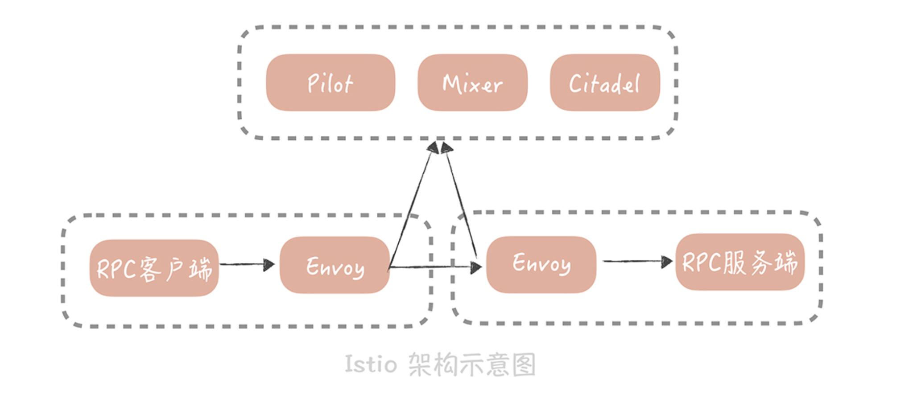
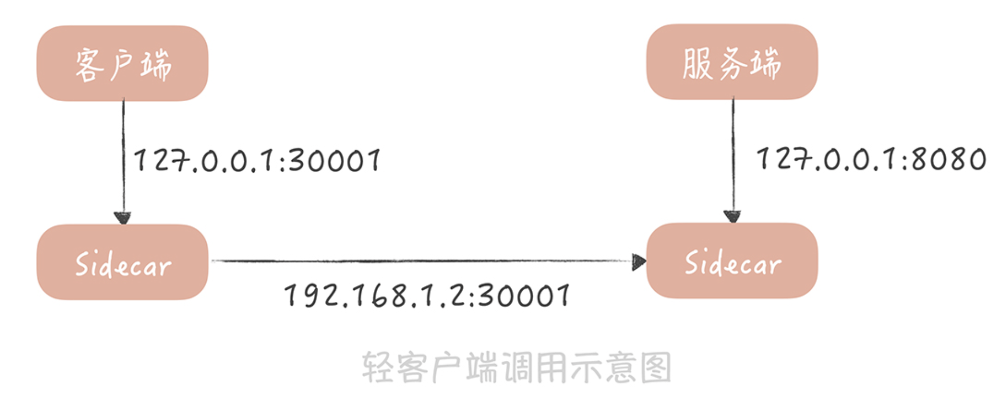

# Service Mesh 服务网格

Service Mesh 主要处理服务之间的通信，它的主要实现形式就是在应用程序同主机上部署一个代理程序，一般来讲，我们将这个代理程序称为 **Sidecar（边车）**，服务之间的通信也从之前的，客户端和服务端直连，变成了下面这种形式：

在这种形式下，RPC 客户端将数据包先发送给，与自身同主机部署的 Sidecar，在 Sidecar 中经过服务发现、负载均衡、服务路由、流量控制之后，再将数据发往指定服务节点的 Sidecar，在服务节点的 Sidecar 中，经过记录访问日志、记录分布式追踪日志、限流之后，再将数据发送给 RPC 服务端。

这种方式，可以把业务代码和服务治理的策略隔离开，将服务治理策略下沉，让它成为独立的基础模块。这样一来，不仅可以实现跨语言，服务治理策略的复用，还能对这些 Sidecar 做统一的管理。

**目前，业界提及最多的 Service Mesh 方案当属 istio ** ，它的玩法是这样的：

它将组件分为 **数据平面** 和 **控制平面**：

- 数据平面就是我提到的 Sidecar（Istio 使用 Envoy 作为 Sidecar 的实现）。
- 控制平面主要负责服务治理策略的执行，在 Istio 中，主要分为 Mixer、Pilot 和 Istio-auth 三部分。

然而，在 Istio 中，每次请求都需要经过控制平面，也就是说，每次请求都需要跨网络的调用 Mixer，这会极大地影响性能。

因此，国内大厂开源出来的 Service Mesh 方案中，一般只借鉴 Istio 的数据平面和控制平面的思路，然后将服务治理策略做到了 Sidecar 中，控制平面只负责策略的下发，这样就不需要每次请求都经过控制平面，性能上会改善很多。

## 如何将流量转发到 Sidecar 中

在 Service Mesh 的实现中，一个主要的问题，是如何尽量无感知地引入 Sidecar 作为网络代理，也就是说，无论是数据流入还是数据流出时，都要将数据包重定向到 Sidecar 的端口上。 **实现思路一般有两个：**

第一种，**使用 iptables 的方式来实现流量透明的转发** ，而 Istio 就默认了，使用 iptables 来实现数据包的转发。为了能更清晰的说明流量转发的原理，我们先简单地回顾一下什么是 iptables。

Iptables 是 Linux 内核中，防火墙软件 Netfilter 的管理工具，它位于用户空间，可以控制 Netfilter，实现地址转换的功能。在 iptables 中默认有五条链，你可以把这五条链，当作数据包流转过程中的五个步骤，依次为 PREROUTING，INPUT，FORWARD，OUTPUT 和 POSTROUTING。数据包传输的大体流程如下：

从图中可以看到，数据包以 PREROUTING 链作为入口，当数据包目的地为本机时，它们也都会流经到 OUTPUT 链。所以，我们可以在这两个链上，增加一些规则，将数据包重定向。我以 Istio 为例，带你看看如何使用 iptables 实现流量转发。

假设服务的节点部署在 9080 端口上，Sidecar 开发的端口是 15001，那么流入流量的流向如下：

流出流量的流量图如下：

**Iptables 方式的优势在于，** 对于业务完全透明，业务甚至不知道有 Sidecar 存在，这样会减少业务接入的时间。不过，它也有缺陷，那就是它是在高并发下，性能上会有损耗，因此国内大厂采用了另外一种方式： **轻量级客户端。**

## 轻量级客户端

在这种方式下，RPC 客户端会通过配置的方式，知道 Sidecar 的部署端口，然后通过一个轻量级客户端，将调用服务的请求发送给 Sidecar，Sidecar 在转发请求之前，先执行一些服务治理的策略，比如说，从注册中心中，查询到服务节点信息并且缓存起来，然后从服务节点中，使用某种负载均衡的策略选出一个节点等等。

请求被发送到服务端的 Sidecar 上后，然后在服务端记录访问日志，和分布式追踪日志，再把请求转发到真正的服务节点上。当然，服务节点在启动时，会委托服务端 Sidecar，向注册中心注册节点，Sidecar 也就知道了真正服务节点部署的端口是多少。整个请求过程如图所示：

当然，除了 iptables 和轻量级客户端两种方式外，目前在探索的方案还有 Cilium，这个方案可以从 Socket 层面实现请求的转发，也就可以避免 iptables 方式在性能上的损耗。 **在这几种方案中，我建议你使用轻量级客户端的方式，** 这样虽然会有一些改造成本，但是却在实现上最简单，可以快速的让 Service Mesh 在你的项目中落地。

目前在开源领域比较成熟的 Service Mesh 框架有下面几个：

- Istio 这个框架在业界最为著名，它提出了数据平面和控制平面的概念，是 Service Mesh 的先驱，缺陷就是刚才提到的 Mixer 的性能问题。
- Linkerd 是第一代的 Service Mesh，使用 Scala 语言编写，其劣势就是内存的占用。
- SOFAMesh 是蚂蚁金服开源的 Service Mesh 组件，在蚂蚁金服已经有大规模落地的经验。

