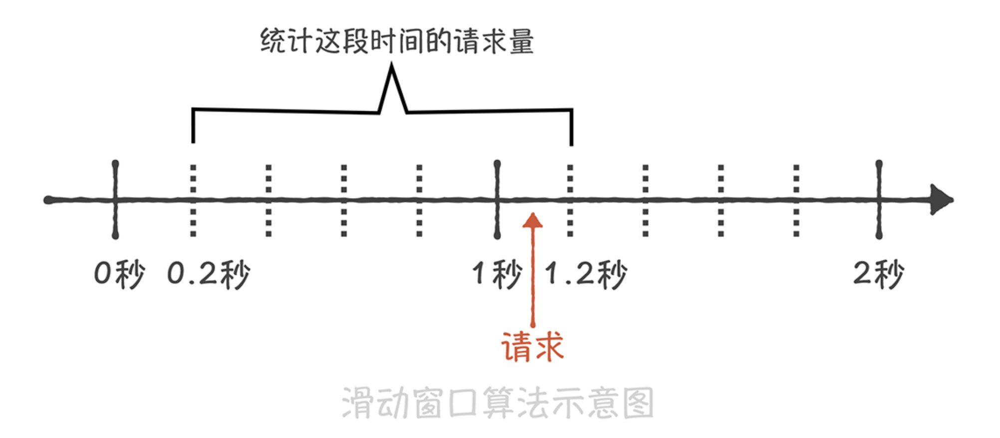
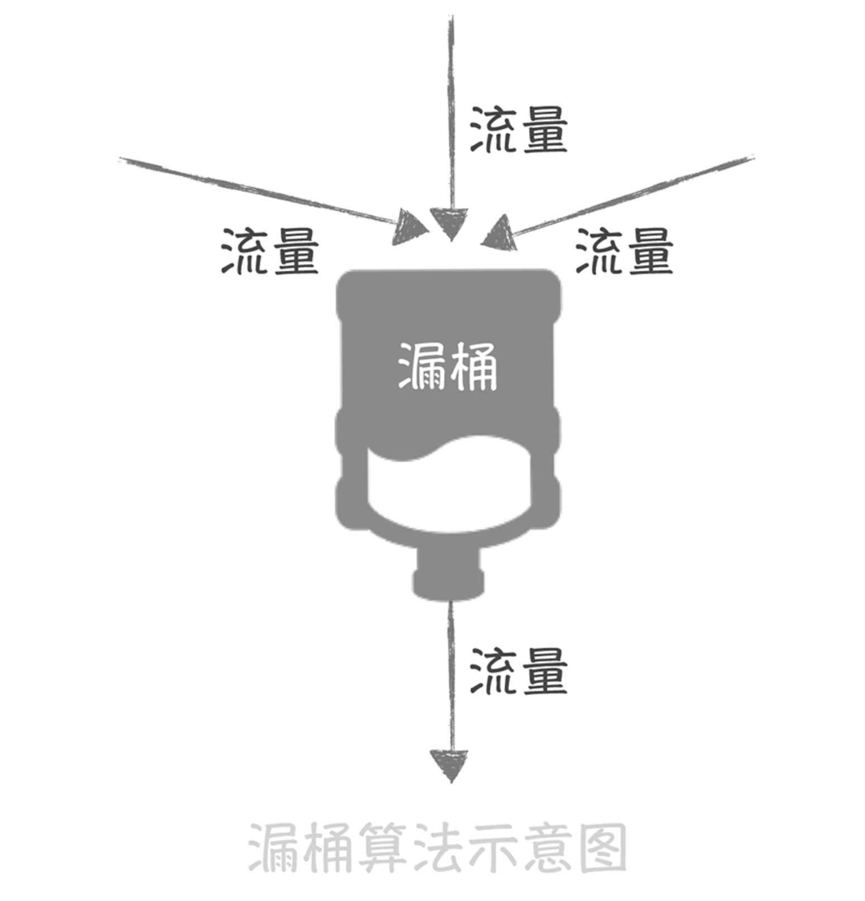
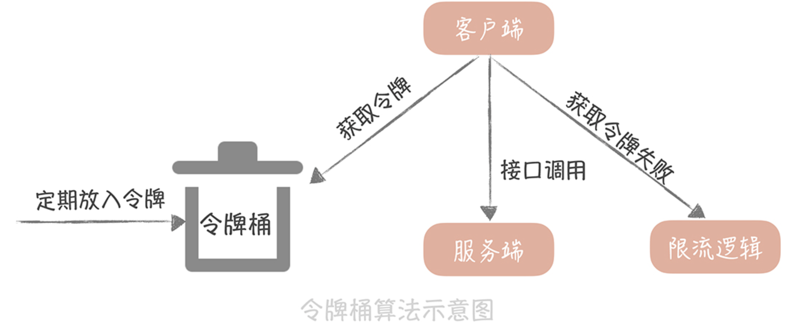

# 熔断、限流

## 熔断

而服务治理中的熔断机制指的是在发起服务调用的时候，如果返回错误或者超时的次数超过一定阈值，则后续的请求不再发向远程服务而是暂时返回错误。

这种实现方式在云计算领域又称为 **断路器模式** ，在这种模式下，服务调用方为每一个调用的服务维护一个有限状态机，在这个状态机中会有三种状态：关闭（调用远程服务）、半打开（尝试调用远程服务）和打开（返回错误）。这三种状态之间切换的过程是下面这个样子。

- 当调用失败的次数累积到一定的阈值时，熔断状态从关闭态切换到打开态。一般在实现时，如果调用成功一次，就会重置调用失败次数。
- 当熔断处于打开状态时，我们会启动一个超时计时器，当计时器超时后，状态切换到半打开态。你也可以通过设置一个定时器，定期地探测服务是否恢复。
- 在熔断处于半打开状态时，请求可以达到后端服务，如果累计一定的成功次数后，状态切换到关闭态；如果出现调用失败的情况，则切换到打开态。

## 限流

### 固定窗口与滑动窗口的算法

我们知道，限流的目的是限制一段时间内发向系统的总体请求量，比如，限制一分钟之内系统只能承接 1 万次请求，那么最暴力的一种方式就是记录这一分钟之内访问系统的请求量有多少，如果超过了 1 万次的限制，那么就触发限流的策略返回请求失败的错误。**如果这一分钟的请求量没有达到限制，那么在下一分钟到来的时候先重置请求量的计数，再统计这一分钟的请求量是否超过限制** 。这种算法叫做 **固定窗口算法** 。

**这种算法虽然实现非常简单，但是却有一个很大的缺陷** ：无法限制短时间之内的集中流量。假如我们需要限制每秒钟只能处理 10 次请求，如果前一秒钟产生了 10 次请求，这 10 次请求全部集中在最后的 10 毫秒中，而下一秒钟的前 10 毫秒也产生了 10 次请求，那么在这 20 毫秒中就产生了 20 次请求，超过了限流的阈值。但是因为这 20 次请求分布在两个时间窗口内，所以没有触发限流，这就造成了限流的策略并没有生效。

**为了解决这个缺陷，就有了基于滑动窗口的算法。 ** 这个算法的原理是将时间的窗口划分为多个小窗口，每个小窗口中都有单独的请求计数。比如下面这张图，我们将 1s 的时间窗口划分为 5 份，每一份就是 200ms；那么当在 1s 和 1.2s 之间来了一次新的请求时，我们就需要统计之前的一秒钟内的请求量，也就是 0.2s～1.2s 这个区间的总请求量，如果请求量超过了限流阈值那么就执行限流策略。

滑动窗口的算法解决了 **临界时间点上突发流量无法控制的问题**，但是却因为要存储每个小的时间窗口内的计数，所以空间复杂度有所增加。

虽然滑动窗口算法解决了窗口边界的大流量的问题，但是它和固定窗口算法一样，还是无法限制短时间之内的集中流量，也就是说无法控制流量让它们更加平滑。 **因此，在实际的项目中，我很少使用基于时间窗口的限流算法，而是使用其他限流的算法：一种算法叫做漏桶算法，一种叫做令牌筒算法。**

### 漏桶算法

漏桶算法的原理很简单，它就像在流量产生端和接收端之间增加一个漏桶，流量会进入和暂存到漏桶里面，而漏桶的出口处会按照一个固定的速率将流量漏出到接收端（也就是服务接口）。

如果流入的流量在某一段时间内大增，超过了漏桶的承受极限，那么多余的流量就会触发限流策略，被拒绝服务。

经过了漏桶算法之后，随机产生的流量就会被整形成为比较平滑的流量到达服务端，从而避免了突发的大流量对于服务接口的影响。 也就是说，无论流入的流量有多么强横，多么不规则，经过漏桶处理之后，流出的流量都会变得比较平滑。

而在实现时，我们一般会使用消息队列作为漏桶的实现，流量首先被放入到消息队列中排队，由固定的几个队列处理程序来消费流量，如果消息队列中的流量溢出，那么后续的流量就会被拒绝。这个算法的思想与消息队列削峰填谷的作用相似。

### 令牌桶算法

令牌桶算法的基本算法是这样的：

- 如果我们需要在一秒内限制访问次数为 N 次，那么就每隔 1/N 的时间，往桶内放入一个令牌；
- 在处理请求之前先要从桶中获得一个令牌，如果桶中已经没有了令牌，那么就需要等待新的令牌或者直接拒绝服务；
- 桶中的令牌总数也要有一个限制，如果超过了限制就不能向桶中再增加新的令牌了。这样可以限制令牌的总数，一定程度上可以避免瞬时流量高峰的问题。

如果要从这两种算法中做选择，我更倾向于使用令牌桶算法，**原因是漏桶算法在面对突发流量的时候，采用的解决方式是缓存在漏桶中，** 这样流量的响应时间就会增长，这就与互联网业务低延迟的要求不符；而令牌桶算法可以在令牌中暂存一定量的令牌，能够应对一定的突发流量，所以一般我会使用令牌桶算法来实现限流方案，而 Guava 中的限流方案就是使用令牌桶算法来实现的。

你可以看到，使用令牌桶算法就需要存储令牌的数量，如果是单机上实现限流的话，可以在进程中使用一个变量来存储；但是如果在分布式环境下，不同的机器之间无法共享进程中的变量，我们就一般会使用 Redis 来存储这个令牌的数量。这样的话，每次请求的时候都需要请求一次 Redis 来获取一个令牌，会增加几毫秒的延迟，性能上会有一些损耗。 **因此，一个折中的思路是：** 我们可以在每次取令牌的时候，不再只获取一个令牌，而是获取一批令牌，这样可以尽量减少请求 Redis 的次数。

