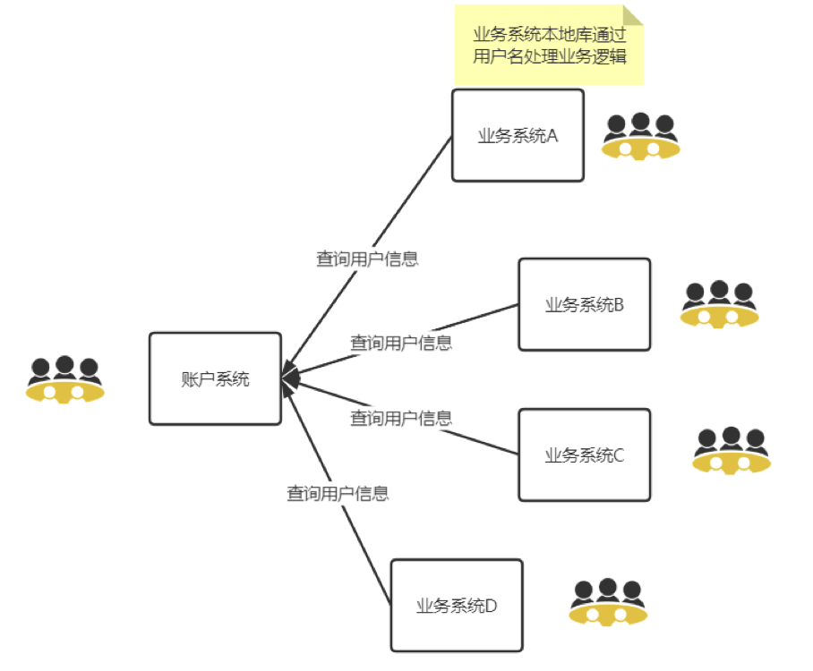
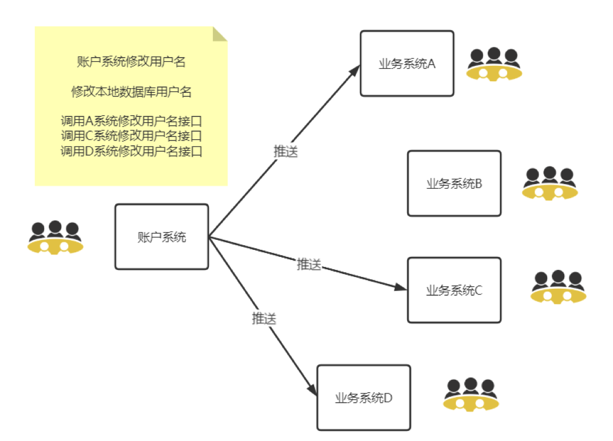
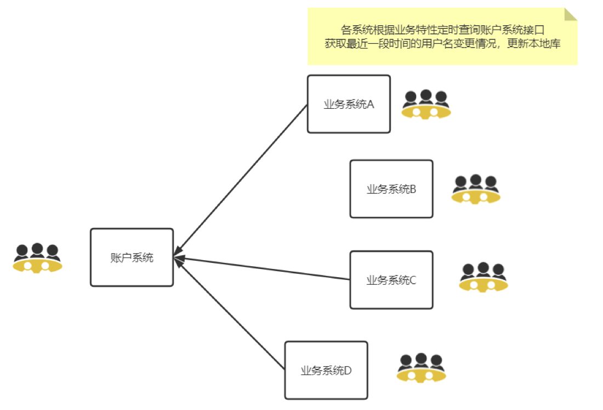

# 推模式（Push）与拉模式（Pull）

可以参考[王雄宁系统设计课程](http://localhost:8080/wxning-blog/interview/system-design/notes/07/03.html)

推模式和拉模式特点

|            | **Push**模式                                                 | **Pull**拉取模式                                           |
| ---------- | ------------------------------------------------------------ | ---------------------------------------------------------- |
| 实时性     | 较好，通过网络管道准实时发送                                 | 较差，取决于定时轮询时间                                   |
| 服务器状态 | 有状态，需持久化粉丝动态队列                                 | 无状态，根据请求实时查询                                   |
| 风险项     | 大V动态的并发“**写扩散**”问题 大量动态队列持久化造成磁盘高IO | 大量粉丝准点“**读扩散**”问题 大V粉丝准点并发查询搞垮服务器 |
| 应用场景   | 微信                                                         | 微博(早期)                                                 |

写扩散（Push）优化：

- 设置上限，微信好友5000个

- 限流策略，X分钟内完成消息发布

- 优化存储策略，采用NoSQL或大数据方案

读扩散（Pull）优化：

- MQ削峰填谷，超长队列直接拒绝

- 增加轮询间隔，减少请求次数

- 服务端增加缓存，优化查询效率

- 增加验证码，分散时间，减少机器人刷票

推特的混合模式：

- 粉丝量小于X，Push模式
  
- 粉丝量大于X，Pull模式

一个例子：业务系统A、B、C、D都需要调账户系统接口查询用户信息并且将用户名保存在自己的数据库中。

但是账户系统的用户名是可以被修改的。这样账户系统就需要调用其他业务系统接口通知。但是这样做耦合性太大。

一个方案是将push模式改为pull模式，不同业务系统可以根据自身特性定时拉取数据。这种模式并发量较大，而且还存在接口耦合，账户系统的接口如果更改需要通知其他业务系统同步更改。

解决接口耦合的方案就是消息队列。

来源：[抽Push或拉Pull，一字之差，差之千里。一个真实架构案例引发的思考](https://www.bilibili.com/video/BV1zh411n7Dw/?spm_id_from=333.788)
